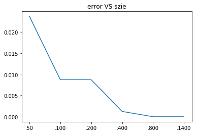
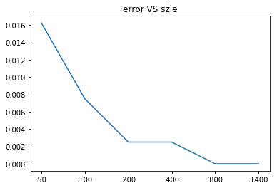

#### 1. Logistic Regression: Training stability

(a)在数据A上训练logistic regression model很快就收敛了，在数据B上训练logistic regression model无法收敛。

(b)观察后可以发现$\theta$的模长来越大，回顾logistic regression model
$$
h_θ(x) = g(θ^T x) ,g(z) = 1/(1 + e^{−z}),g(z)' = g(z)(1-g(z))
$$
当$\theta$的模长很大时，$\theta^Tx$的模长很大，$g(\theta^T x) \to 0$，$g(z)' = g(z)(1-g(z)) \to 0$，从而梯度会越来越小，训练会很慢。

之所以数据B发生这个现象而A没有发生这个现象，是因为数据A线性不可分，数据B线性可分。

由数据B线性可分可的
$$
y_i\theta^T x_i \ge 0
$$
我们的目标函数为
$$
J(\theta) =-\frac 1 m \sum_{i=1}^m \log (h_{\theta}(y^{(i)}x^{(i)}))
$$
要使得使得目标函数越小，只要$h_{\theta}(y^{(i)}x^{(i)})$越大即可，由于$y_i\theta^T x_i\ge 0$，所以$\theta$的模长越大，$y_i\theta^T x_i$就会越大，由梯度下降的性质可知，迭代之后会让$\theta​$的模长越来越大，就会发生上述现象。

而数据$A$不是线性可分的，所以存在$j​$，使得
$$
y_j\theta^T x_j < 0
$$
所以算法不会让$\theta$的模长不停地增加。

(c)要解决上述问题，关键是不能让$\theta$的模长不停地增长，所以(iii),(v)是最好的方法。

(d)SVM不会发生这个问题，因为SVM是最大间隔分类器，即使可分，最大距离分类器也是唯一的，不会无限迭代下去。

而logistic回归实际上是在让函数间隔变大，所以会出现无法收敛的情形。


#### 2.Model Calibration

(a)只要考虑两个分子即可，logistic回归的输出范围为$(0,1)$，题目中的$(a,b) = (0,1)$，所以
$$
\sum_{i\in I_{a,b}} P (y^{(i)} = 1|x^{(i)} ; θ)= \sum_{i=1}^m  P (y^{(i)} = 1|x^{(i)} ; θ) \\
\sum_{i\in I_{a,b}}1\{y^{(i)} = 1\} =  \sum_{i=1}^m  1\{y^{(i)} = 1\}
$$
接下来证明这两项相等。

回顾损失函数
$$
J(\theta) =-\frac 1 m \sum_{i=1}^m \Big(y^{(i)}\log (h_{\theta}(x^{(i)})) +
(1-y^{(i)})\log (1-h_{\theta}(x^{(i)}))
\Big)\\
y^{(i)} ∈\{0, 1\}, h_θ(x) = g(θ^T x) ,g(z) = 1/(1 + e^{−z})
$$
回顾课本的讲义可得
$$
\frac{\partial} {\partial \theta_j} J(\theta)
=-\frac 1 m \sum_{i=1}^m (y^{(i)}- h_{\theta}(x^{(i)})) x_j
$$
那么
$$
\nabla_{\theta} J(\theta) = -\frac 1 m  X^T S
$$
其中
$$
x_k=[1,x_1^{(k)},...,x_n^{(k)}]^T \in \mathbb  R^{n+1}\\
  X=  \left[
 \begin{matrix}
 x_1^T\\
  ...\\
x_m^T 
  \end{matrix}
  \right] =
   \left[
 \begin{matrix}
 1 &x_1^{(1)} & ... &x_n^{(1)}\\
  ...&...& ... &...\\
 1 &x_1^{(m)} & ... &x_n^{(m)}
  \end{matrix}
  \right] 
  \in  \mathbb R^{m\times (n+1)} \\
  S = \left[
 \begin{matrix}
  y^{(1)}-h_θ(x^{(1)}) \\
... \\
  y^{(m)}-h_θ(x^{(m)})
  \end{matrix}
  \right] \in \mathbb  R^m
$$
由$\theta​$的选择规则可知
$$
X^T S =0 
$$
这里有$n+1$个等式，注意$X^T$的第一行全为$1$，所以我们考虑第一个等式
$$
[1,...,1] S = 0 \\
 \sum_{i=1}^m  y^{(i)}-h_θ(x^{(i)}) = 0\\
  \sum_{i=1}^m y^{(i)}  =   \sum_{i=1}^mh_θ(x^{(i)})
$$
由于$y^{(i)} \in \{0,1\}, h_θ(x^{(i)}) = P (y^{(i)} = 1|x^{(i)} ; θ)$，所以上式即为
$$
\sum_{i=1}^m  P (y^{(i)} = 1|x^{(i)} ; θ) =   \sum_{i=1}^m  1\{y^{(i)} = 1\}
$$
从而
$$
\sum_{i\in I_{a,b}} P (y^{(i)} = 1|x^{(i)} ; θ)=\sum_{i\in I_{a,b}}1\{y^{(i)} = 1\}
$$
命题得证。

(b)考虑两个数据的数据集$x^{(1)},x^{(2)}$，不妨设$y^{(1)}=1,y^{(2)}=0$，如果
$$
P (y^{(1)} = 1|x^{(1)} ; θ) =0.4,  P (y^{(2)} = 1|x^{(2)} ; θ) =0.6
$$
那么我们预测$y^{(1)} = 0,y^{(2)} = 1​$，准确率为$0​$，但是
$$
\sum_{i\in I_{a,b}} P (y^{(i)} = 1|x^{(i)} ; θ)=\sum_{i\in I_{a,b}}1\{y^{(i)} = 1\}= 1
$$
所以perfectly calibrated无法推出perfect accuracy。

反之，如果
$$
P (y^{(1)} = 1|x^{(1)} ; θ) =0.6,  P (y^{(2)} = 1|x^{(2)} ; θ) =0.3
$$
那么我们预测$y^{(1)} = 1,y^{(2)} = 0$，此时准确率为$1$，但是
$$
\sum_{i\in I_{a,b}} P (y^{(i)} = 1|x^{(i)} ; θ)=0.9\neq \sum_{i\in I_{a,b}}1\{y^{(i)} = 1\}= 1
$$
所以perfect accuracy无法推出perfectly calibrated。

(c)设损失函数为
$$
J(\theta) =-\frac 1 m \sum_{i=1}^m \Big(y^{(i)}\log (h_{\theta}(x^{(i)})) +
(1-y^{(i)})\log (1-h_{\theta}(x^{(i)}))
\Big) + C \sum_{i=1} ^{n+1} \theta_i^2
$$
记
$$
\theta = \left[
 \begin{matrix}
  \theta_1\\
... \\
 \theta_{n+1}
  \end{matrix}
  \right]
$$
继续使用(a)的记号，那么
$$
\nabla J(\theta) = -\frac 1  m X^T S +2C \theta  =0 \\
X^T S  = 2m C\theta 
$$
依旧考虑第一个等式
$$
[1,...,1] S =  2mC \theta_1 \\ 
 \sum_{i=1}^m y^{(i)}-h_θ(x^{(i)}) = 2mC \theta_1 \\ 
   \sum_{i=1}^m y^{(i)}  =   \sum_{i=1}^mh_θ(x^{(i)})+ 2mC\theta_1 \\
    \sum_{i=1}^m  1\{y^{(i)} = 1\} = \sum_{i=1}^m  P (y^{(i)} = 1|x^{(i)} ; θ)  +  2mC\theta_1
$$
从而
$$
\sum_{i=1}^m  1\{y^{(i)} = 1\} = \sum_{i=1}^m  P (y^{(i)} = 1|x^{(i)} ; θ)  +  2mC\theta_1
$$


#### 3.Bayesian Logistic Regression and weight decay

回顾定义
$$
\begin{aligned}
θ_{\text{MAP}} 
&= \arg \max_θ p(θ) \prod _{i=1}^m p(y^{(i)}|x^{(i)}, θ)  \\
&=  \arg \max_θ  \exp({- \frac{||\theta||^2}{2 \tau ^2}} ) \prod _{i=1}^m p(y^{(i)}|x^{(i)}, θ)
\end{aligned}
$$
由定义可知
$$
\exp({- \frac{||θ_{\text{MAP}}||^2}{2 \tau ^2}} ) \prod _{i=1}^m p(y^{(i)}|x^{(i)}, θ_{\text{MAP}}) \ge  \exp({- \frac{||θ_{\text{ML}}||^2}{2 \tau ^2}} ) \prod _{i=1}^m p(y^{(i)}|x^{(i)},θ_{\text{ML}})
$$
因为
$$
\prod _{i=1}^m p(y^{(i)}|x^{(i)}, θ_{\text{MAP}})\le  \prod _{i=1}^m p(y^{(i)}|x^{(i)},θ_{\text{ML}})
$$
所以
$$
\exp({- \frac{||θ_{\text{MAP}}||^2}{2 \tau ^2}} )  \ge  \exp({- \frac{||θ_{\text{ML}}||^2}{2 \tau ^2}} ) 
$$
从而
$$
||θ_{\text{MAP}}||_2 \le ||θ_{\text{ML}}||_2
$$


#### 4.Constructing kernels

假设$K_i$对应的矩阵为$M_i$，$K$对应矩阵为$M$，由核函数的定义可知$M_i $为半正定阵。

(a)$K(x,z)= K_1(x,z) + K_2(x,z) $是核，因为
$$
\begin{aligned}
x^TMx&=x^T(M_1+M_2)x
\\&=x^TM_1x+x^TM_2x
\\&\ge0
\end{aligned}
$$
(b)$K(x,z)= K_1(x,z) -K_2(x,z) $不是核。取$K_2(x,z)=2K_1(x,z)$
$$
x^TMx=x^T(M_1-M_2)x=-x^TM_1x\le0
$$
(c)$K(x,z) = aK_1(x,z) ,a>0$是核
$$
\begin{aligned}
x^TMx&=x^T(aM_1)x
\\&=ax^TMx
\\&\ge0
\end{aligned}
$$
(d)$K(x,z) = -aK_1(x,z) ,a>0​$不是核
$$
\begin{aligned}
x^TMx&=x^T(-aM_1)x
\\&=-ax^TMx
\\&\le0
\end{aligned}
$$
(e)$K(x,z) = K_1(x,z) K_2(x,z)$是核

因为$K_1,K_2$为核，所以设$K_1(x,z) = Φ_1(x) Φ^T_1(z),K_2=Φ_2(x) Φ^T_2(z)$。

记$\Phi(x)$是$Φ_1(x)Φ_2^T(x)$每一行拼接而成的向量，设$Φ_1(x),Φ_2(x)\in \mathbb R^n$，给出以下记号
$$
\Phi^i(x)=Φ_1^{i}(x)Φ^T_2(x)\in\mathbb  R^{1\times n}\\
Φ^{i}_1(x)为Φ_1(x)的第i个分量
$$
那么
$$
\begin{aligned}
\Phi(x) =
 \left[
 \begin{matrix}
   Φ^1(x) &
   Φ^2(x)&
...&
     Φ^n(x)
  \end{matrix}
  \right] \in \mathbb R^{1\times n^2}
\end{aligned}
$$
接着计算$\Phi(x) \Phi^T(x') ​$，注意$\Phi^i(x)​$为行向量
$$
\begin{aligned}
(Φ(x) Φ^T(x^{'}))
&=\sum_{i=1}^n  (Φ^i(x))Φ^i(x^{'})^T\\
&=\sum_{i=1}^n (Φ_1^{i}(x)Φ_2(x)^T)(Φ_1^{i}(x^{'})Φ_2(x^{'})^T)^T\\
&=\sum_{i=1}^nΦ_1^{i}(x)Φ_1^{i}(x^{'})Φ_2(x)^TΦ_2(x^{'})\\
&=\sum_{i=1}^nΦ_1^{i}(x)Φ_1^{i}(x^{'})K_2(x,x^{'})\\
&=K_2(x,x^{'})\sum_{i=1}^nΦ_1^{i}(x)Φ_1^{i}(x^{'})\\
&=K_2(x,x^{'})K_1(x,x^{'})
\end{aligned}
$$
所以$Φ(x)$对应的核为$K_1(x,x^{'})K_2(x,x^{'})$，从而$K(x,z) = K_1(x,z) K_2(x,z)$是核。

(f)$K(x,z) = f(x)f(z)$是核，因为符合定义。

(g)$K(x,z) = K_3(\phi(x), \phi(z))$是核，因为
$$
y^T M y =y^T M_3 y \ge 0
$$
(h)由(e)可知，如果$K_1$是核，那么$K_1^i (i\ge1, i\in N)$也是核，又由(a)(c)可得核函数的正系数的线性组合为核，所以$K(x,z)=p(K_1(x,z))$也是核。


#### 5.Kernelizing the Perceptron

设这里的数据为$x^{(1)},...,x^{(m)}$

(a)根据更新公式
$$
θ^{(i+1)} := θ^{(i)} + α1\{g({θ^{(i)}}^T \phi(x^{(i+1)}))y^{(i+1)} < 0\}y^{(i+1)}\phi(x^{(i+1)})
$$
如果初始化$\theta^{(0)}=0​$，那么$\theta^{(i)}​$可以表示为$\phi(x^{(i)})​$的线性组合，从而
$$
\theta^{(i)} = \sum_{j=1}^i \beta_j \phi(x^{(j)})
$$
(b)计算$g({θ^{(i)}}^T \phi(x^{(i+1)}))​$
$$
g({θ^{(i)}}^T \phi(x^{(i+1)})) = g\Big( \sum_{j=1}^i \beta_j \phi(x^{(j)})^T \phi(x^{(i+1)}) \Big) = g\Big( \sum_{j=1}^i \beta_j M_{j,i+1}  \Big)
$$
(c)由上述公式可知，第$i​$次我们只要更新$\beta_i ​$即可，更新公式如下
$$
\beta_{i+1}= \alpha 1\{ g({θ^{(i)}}^T \phi(x^{(i+1)})) y^{(i+1)} <0\} y^{(i+1)}
$$


#### 6.Spam classification

(a)(b)(c)

代码的注释比较详细，这里只说明一点，在朴素贝叶斯中我们需要计算：
$$
\prod^m_{i=1}\Big(\prod^{n_i}_{j=1}
p(x^{(i)}_j|y^{(i)}; \phi_{k|y=0}, \phi_{k|y=1}) p( y^{(i)};\phi_y)\Big)
$$
题目中计算的对数概率，这是为了防止数值过小变为$0$
$$
\sum_{i=1}^n \Big(\sum_{j=1}^{n_i} \log p(x^{(i)}_j|y^{(i)}; \phi_{k|y=0}, \phi_{k|y=1}) 
+\log p( y^{(i)};\phi_y) \Big)
$$

```python
# -*- coding: utf-8 -*-
"""
Created on Thu Mar 14 15:58:26 2019

@author: qinzhen
"""

import numpy as np
import matplotlib.pyplot as plt

def readMatrix(file):
    fd = open(file, 'r')
    #读取第一行
    hdr = fd.readline()
    #读取行列
    rows, cols = [int(s) for s in fd.readline().strip().split()]
    #读取单词
    tokens = fd.readline().strip().split()
    #构造空矩阵
    matrix = np.zeros((rows, cols))
    Y = []
    #line为每行的元素
    for i, line in enumerate(fd):
        nums = [int(x) for x in line.strip().split()]
        #第一个元素表示是否为垃圾邮件
        Y.append(nums[0])
        #将后续数据读入
        kv = np.array(nums[1:])
        #从第一个开始每两个累加
        k = np.cumsum(kv[:-1:2])
        #从第二个开始每隔一个取出
        v = kv[1::2]
        #这里应该是一种特殊的存储格式，我们直接使用即可
        matrix[i, k] = v
    return matrix, tokens, np.array(Y)

def nb_train(matrix, category):
    #matrix(i,j)表示第i个邮件中第j个元素出现了几次
    state = {}
    #token的数量
    N = matrix.shape[1]
    #邮件数量
    M = matrix.shape[0]
    ###################
    
    #垃圾邮件的数量
    y1 = matrix[category==1]
    n1 = np.sum(y1)
    #非垃圾邮件的数量
    y0 = matrix[category==0]
    n0 = np.sum(y0)
    
    #P(y=1)
    p1 = y1.shape[0] / M
    #P(y=0)
    p0 = y0.shape[0] / M
    state[-1] = [p0, p1]
    
    for i in range(N):
        #找到第i个token
        #垃圾邮件中第i个token出现的数量
        s1 = matrix[category==1][:, i]
        #拉普拉斯平滑
        u1 = (s1.sum() + 1) / (n1 + N)
        #非垃圾邮件中第i个token出现的数量
        s0 = matrix[category==0][:, i]
        #拉普拉斯平滑
        u0 = (s0.sum() + 1) / (n0 + N)
        #存入字典
        state[i] = [u0, u1]

    ###################
    return state

def nb_test(matrix, state):
    output = np.zeros(matrix.shape[0])
    ###################
    #邮件数量
    M = matrix.shape[0]
    #token的数量
    N = matrix.shape[1]
    for i in range(M):
        #第i个邮件
        vector = matrix[i]
        s1 = np.log(state[-1][1])
        s0 = np.log(state[-1][0])
        
        for j in range(N):
            #对第j个token的对数概率做累加
            s1 += vector[j] * np.log(state[j][1])
            s0 += vector[j] * np.log(state[j][0])
        if s1 > s0:
            output[i] = 1

    ###################
    return output

def evaluate(output, label):
    error = (output != label).sum() * 1. / len(output)
    print('Error: %1.4f' % error)
    return error
    
def nb(file):
    trainMatrix, tokenlist, trainCategory = readMatrix(file)
    testMatrix, tokenlist, testCategory = readMatrix('MATRIX.TEST')
    
    state = nb_train(trainMatrix, trainCategory)
    output = nb_test(testMatrix, state)
    
    return evaluate(output, testCategory)

trainMatrix, tokenlist, trainCategory = readMatrix('MATRIX.TRAIN')
testMatrix, tokenlist, testCategory = readMatrix('MATRIX.TEST')

state = nb_train(trainMatrix, trainCategory)
output = nb_test(testMatrix, state)

evaluate(output, testCategory)

#problem b
b=[]
for i in range(1448):
    b.append((i,np.log(state[i][1])-np.log(state[i][0])))
    
b.sort(key=lambda i:i[-1],reverse=True)
key = b[:5]

word = []
for i in key:
    word.append(tokenlist[i[0]])
    
print(word)

#problem c
size = ['.50','.100','.200','.400','.800','.1400']
size1 = [50, 100, 200, 400, 800, 1400]
train = "MATRIX.TRAIN"
error = []
for i in size:
    file = train+i
    error.append(nb(file))
    
plt.plot(size, error)
plt.title("error VS szie")
```

```
Error: 0.0025
Error: 0.0238
Error: 0.0088
Error: 0.0088
Error: 0.0013
Error: 0.0000
Error: 0.0000
```



(d)这部分老师已经提供，但这里还是详细解释下。

首先这题需要计算高斯核矩阵，所以我们需要计算$[||x^{(i)}-x^{(j)}||^2]_{i,j}$，下面介绍向量化计算的方法：

假设
$$
X = \left[
 \begin{matrix}
  — (x^{(1)})^T— \\
— (x^{(2)})^T— \\
\vdots\\
— (x^{(m)})^T— 
  \end{matrix}
  \right] \in \mathbb R^{m \times d}, Y =  \left[
 \begin{matrix}
  — (y^{(1)})^T— \\
— (y^{(2)})^T— \\
\vdots\\
— (y^{(n)})^T— 
  \end{matrix}
  \right] \in \mathbb R^{n \times d}
$$
其中$x^{(i)} ,y^{(i)} \in \mathbb R^d$，现在的问题是如何高效计算矩阵$D \in \mathbb R^{m\times n}$，其中
$$
D_{i,j} = ||x^{(i)} -y^{(j)} ||^2
$$
首先对$D_{i,j}$进行处理
$$
\begin{aligned}
D_{i,j} &= ||x^{(i)} -y^{(j)} ||^2 \\
&= (x^{(i)} -y^{(j)})^T (x^{(i)} -y^{(j)})\\
&=(x^{(i)})^T x^{(i)} -2(x^{(i)})^Ty^{(j)} +(y^{(j)})^T y^{(j)}
\end{aligned}
$$
那么
$$
\begin{aligned}
D &=  \left[
 \begin{matrix}
   D_{1,1} & ... & D_{1,n} \\
  ... &  ... &  ... \\
   D_{m,1} &  ... & D_{m,n} 
  \end{matrix}
  \right]  \\
  &= \left[
 \begin{matrix}
   (x^{(1)})^T x^{(1)} -2(x^{(1)})^Ty^{(1)} +(y^{(1)})^T y^{(1)} & ... & 
     (x^{(1)})^T x^{(1)} -2(x^{(1)})^Ty^{(n)} +(y^{(n)})^T y^{(n)}\\
  ... &  ... &  ... \\
   (x^{(m)})^T x^{(m)} -2(x^{(m)})^Ty^{(1)} +(y^{(1)})^T y^{(1)}  &  ... & 
    (x^{(m)})^T x^{(m)} -2(x^{(m)})^Ty^{(n)} +(y^{(n)})^T y^{(n)} 
  \end{matrix}
  \right] \\
  &= \left[
 \begin{matrix}
   (x^{(1)})^T x^{(1)} & ... & 
     (x^{(1)})^T x^{(1)} \\
  ... &  ... &  ... \\
   (x^{(m)})^T x^{(m)}  &  ... & 
    (x^{(m)})^T x^{(m)} 
  \end{matrix}
  \right] +\left[
 \begin{matrix}
   (y^{(1)})^T y^{(1)} & ... & 
     (y^{(n)})^T y^{(n)} \\
  ... &  ... &  ... \\
  (y^{(1)})^T y^{(1)} & ... & 
     (y^{(n)})^T y^{(n)}
  \end{matrix}
  \right]-
  2\left[
 \begin{matrix}
   (x^{(1)})^T y^{(1)} & ... & 
     (x^{(1)})^T y^{(n)} \\
  ... &  ... &  ... \\
  (x^{(m)})^T y^{(1)} & ... & 
     (x^{(m)})^T y^{(n)}
  \end{matrix}
  \right]\\
  &=\left[
 \begin{matrix}
   (x^{(1)})^T x^{(1)} \\
  ...  \\
   (x^{(m)})^T x^{(m)}  
  \end{matrix}
  \right]\underbrace{\left[
 \begin{matrix}
1&...&1
  \end{matrix}
  \right]}_{1\times n矩阵}  +\underbrace{\left[
 \begin{matrix}
1\\ 
\vdots \\
1
  \end{matrix}
  \right]}_{m\times 1矩阵} \left[
 \begin{matrix}
   (y^{(1)})^T y^{(1)}  &
  \ldots  &
  (y^{(n)})^T y^{(n)} 
  \end{matrix}
  \right] -2XY^T
\end{aligned}
$$
特别的，这里$X=Y$，所以上述代码如下：

```python
d1 = np.sum(matrix ** 2, axis=1).reshape(-1, 1)
d2 = d1.T
dist = d1 + d2 - 2 * matrix.dot(matrix.T)
```

带入高斯核的计算公式可得：

```python
k = np.exp(- dist / (2 * (tau ** 2)))
```

老师给出的代码为：

```python
gram = matrix.dot(matrix.T)
squared = np.sum(matrix*matrix, axis=1)
k = np.exp(-(squared.reshape((-1,1)) + squared.reshape((1,-1)) - 2 * gram) / (2 * (tau ** 2)))
```

为了解释剩余代码，首先介绍SVM对应的合页损失函数（参考统计学习方法113页）：
$$
\sum_{i=1}^N [1-y^{(i)} (w^Tx^{(i)}+b)]_+ + \lambda ||w ||^2
$$
其中
$$
[x]_+ =\begin{cases}
1 & x > 0\\
0 &x\le 0
\end{cases}
$$
假设SVM对应的特征转换为$\phi (x)$，那么由课上的讨论可知，$w$的形式如下：
$$
w =\sum_{j=1}^ N \alpha_j \phi(x^{(j)}) \tag 1 
$$
与之对应的损失函数为
$$
\begin{aligned}
\sum_{i=1}^N [1-y^{(i)} (w^T\phi(x^{(i)})+b)]_+ + \lambda ||w ||^2 
&=\sum_{i=1}^N \Big[1-y^{(i)} \Big(\big(\sum_{j=1}^ N \alpha_j \phi(x^{(j)}) \big)^T\phi(x^{(i)})+b\Big)\Big]_+ \\
&+\lambda \Big(\sum_{j=1}^ N \alpha_j \phi(x^{(j)})\Big)^T 
\Big(\sum_{j=1}^ N \alpha_j \phi(x^{(j)}) \Big) \\
&=\sum_{i=1}^N \Big[1-y^{(i)} \Big(\sum_{j=1}^ N \alpha_j \phi^T(x^{(j)}) \phi(x^{(i)})+b\Big)\Big]_+ \\
& + \lambda  \sum_{i=1}^N \sum_{j=1}^N \alpha_i \alpha_j 
\phi^T(x^{(i)}) \phi(x^{(j)})
\end{aligned}
$$
由(1)可知，我们只要求出$\alpha= (\alpha_1,...,\alpha_N)^T$即可，所以可以关于$\alpha$做梯度随机梯度下降法，注意一个样本（不妨设为$x^{(i)}$）对应的损失函数为
$$
L_i\triangleq \Big[1-y^{(i)} \Big(\sum_{j=1}^ N \alpha_j \phi^T(x^{(j)}) \phi(x^{(i)})+b\Big)\Big]_+ 
 +\frac \lambda N  \sum_{s=1}^N  \sum_{t=1}^N \alpha_s \alpha_t 
\phi^T(x^{(s)}) \phi(x^{(t)})
$$
记核矩阵为$K$，对上式关于$\alpha_k $求偏导可得
$$
\begin{aligned}
\frac{\partial L}{\partial \alpha_k}
&= 1\{\big[1-y^{(i)} (\sum_{j=1}^ N \alpha_j \phi^T(x^{(j)}) \phi(x^{(i)})+b)\big] >0 \}
\times\Big(-y^{(i)} \phi^T(x^{(k)}) \phi(x^{(i)}) \Big) +

2\frac \lambda N \Big(   \sum_{j=1}^N  \alpha_j \phi^T(x^{(j)}) \phi(x^{(k)}) \Big) \\
&= 1\{\big[1-y^{(i)} (w^T \phi(x^{(i)})+b)\big] >0 \}
\times\Big(-y^{(i)} \phi^T(x^{(k)}) \phi(x^{(i)}) \Big) +

2\frac \lambda N \Big(    \phi(x^{(i)}) w^T\Big) \\
&= 1\{\big[1-y^{(i)} (w^T \phi(x^{(i)})+b)\big] >0 \}
\times\Big(-y^{(i)} K_{k,i} \Big) +

2\frac \lambda N \Big(    \phi(x^{(i)}) w^T\Big) \\
\end{aligned}
$$
因此梯度为
$$
\begin{aligned}
\nabla_{\alpha }L = 
1\{\big[1-y^{(i)} (w^T \phi(x^{(i)})+b)\big] >0 \}(-y^{(i)})
 \left[
 \begin{matrix}
   K_{1,i}   \\
 \vdots   \\
  K_{N,i}  
  \end{matrix}
  \right]
  +\frac{2\lambda} N K  \alpha
\end{aligned}
$$
所以计算梯度的过程如下，首先随机选个更新的样本（M为样本的数量）：

```python
i = int(np.random.rand() * M)
```

接着计算函数间隔（k为之前计算的核矩阵）：

```python
margin = category[i] * (k[i, :].dot(alpha))
```

然后计算正则项的梯度，注意这里我和老师给的计算式不大一样，老师给的式子如下：

```python
grad = M * L * k[:, i] * alpha[i]
```

我的计算式如下：

```python
grad = L * k.dot(alpha)
```

这里系数没有那么重要，实验结果表明两种方法的效果都尚可。

最后根据函数间隔是否大于$1$决定是否更新前一项的梯度：

```python
if(margin < 1):
	grad -= category[i] * k[:, i]
```

代码中的梯度除以了迭代次数$j​$的一个函数，这是为了让梯度逐渐变小：

```python
alpha -= grad / ((np.sqrt(j+1)))
```

完整代码如下：

```python
# -*- coding: utf-8 -*-
"""
Created on Thu Mar 14 16:04:08 2019

@author: qinzhen
"""

import numpy as np
import matplotlib.pyplot as plt

tau = 8.

def readMatrix(file):
    fd = open(file, 'r')
    hdr = fd.readline()
    rows, cols = [int(s) for s in fd.readline().strip().split()]
    tokens = fd.readline().strip().split()
    matrix = np.zeros((rows, cols))
    Y = []
    for i, line in enumerate(fd):
        nums = [int(x) for x in line.strip().split()]
        Y.append(nums[0])
        kv = np.array(nums[1:])
        k = np.cumsum(kv[:-1:2])
        v = kv[1::2]
        matrix[i, k] = v
    #化为正负1
    category = (np.array(Y) * 2) - 1
    return matrix, tokens, category

def svm_train(matrix, category):
    state = {}
    M, N = matrix.shape
    #####################
    #大于0的化为1
    matrix = 1.0 * (matrix > 0)
    '''
    #构造kernel矩阵
    d1 = np.sum(matrix ** 2, axis=1).reshape(-1, 1)
    d2 = d1.T
    squared = matrix.dot(matrix.T)
    dist = d1 + d2 - 2 * squared
    k = np.exp(- dist / (2 * (tau ** 2)))
    '''
    gram = matrix.dot(matrix.T)
    squared = np.sum(matrix*matrix, axis=1)
    k = np.exp(-(squared.reshape((-1,1)) + squared.reshape((1,-1)) - 2 * gram) / (2 * (tau ** 2)))
    
    #初始化向量
    alpha = np.zeros(M)
    #循环次数
    n = 40
    #系数
    L = 1. / (64 * M)
    #平均值
    alpha_avg = np.zeros(M)
    
    for j in range(n * M):
        #随机取一个样本
        i = int(np.random.rand() * M)
        #计算函数间隔
        margin = category[i] * (k[i, :].dot(alpha))
        #grad = M * L * k[:, i] * alpha[i]
        grad = L * k.dot(alpha)
        if(margin < 1):
            grad -= category[i] * k[:, i]
        alpha -= grad / ((np.sqrt(j+1)))
        alpha_avg += alpha
    
    alpha_avg /= (n * M)
    
    state['alpha'] = alpha
    state['alpha_avg'] = alpha_avg
    state['Xtrain'] = matrix
    state['Sqtrain'] = squared
    
    ####################
    return state


def svm_test(matrix, state):
    M, N = matrix.shape
    output = np.zeros(M)
    ###################
    Xtrain = state['Xtrain']
    Sqtrain = state['Sqtrain']
    #大于0的化为1
    matrix = 1.0 * (matrix > 0)
    #做测试集的kernel
    gram = matrix.dot(Xtrain.T)
    squared = np.sum(matrix * matrix, axis=1)
    k = np.exp(-(squared.reshape((-1, 1)) + Sqtrain.reshape((1, -1)) - 2 * gram) / (2 * (tau**2)))
    #读取alpha
    alpha_avg = state['alpha_avg']
    #预测
    pred = k.dot(alpha_avg)
    output = np.sign(pred)
    
    ###################
    return output

def evaluate(output, label):
    error = (output != label).sum() * 1. / len(output)
    print('Error: %1.4f' % error)
    return error

def svm(file):
    trainMatrix, tokenlist, trainCategory = readMatrix(file)
    testMatrix, tokenlist, testCategory = readMatrix('MATRIX.TEST')
    
    state = svm_train(trainMatrix, trainCategory)
    output = svm_test(testMatrix, state)
    
    return evaluate(output, testCategory)


trainMatrix, tokenlist, trainCategory = readMatrix('MATRIX.TRAIN.400')
testMatrix, tokenlist, testCategory = readMatrix('MATRIX.TEST')

state = svm_train(trainMatrix, trainCategory)
output = svm_test(testMatrix, state)

evaluate(output, testCategory)

size = ['.50','.100','.200','.400','.800','.1400']
size1 = [50, 100, 200, 400, 800, 1400]
train = "MATRIX.TRAIN"
error = []
for i in size:
    file = train+i
    error.append(svm(file))
    
plt.plot(size, error)
plt.title("error VS szie")
```

```
Error: 0.0025
Error: 0.0163
Error: 0.0075
Error: 0.0025
Error: 0.0025
Error: 0.0000
Error: 0.0000
```



(e)对比两图可以发现，和NB算法相比，SVM算法的效果更好。

