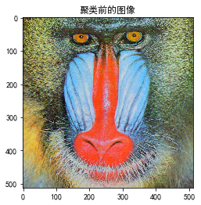
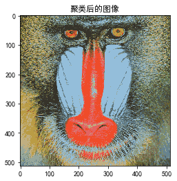

#### Problem 1

记第二层的输出为$g^{(i)}$

(a)由$w^{[1]}_{1,2}​$的定义可知，我们需要先求出关于$h_2​$的偏导数。

注意到我们有
$$
o^{(i)} = f(w^{[2]}_{0}+w^{[2]}_{1} h_1^{(i)}+w^{[2]}_{2} h_2^{(i)} + w^{[2]}_{3} h_3^{(i)})
$$
其中$f$为sigmoid函数，那么先计算$l$关于$h_2^{(i)} $的偏导数可得
$$
\begin{aligned}
\frac{\partial l}{\partial h_2^{(i)}} 
&=\frac{\partial l}{\partial o^{(i)}} 
\frac{\partial o^{(i)}}{\partial h_2^{(i)}}\\
&=\frac 1 m (o^{(i)}-y^{(i)})  o^{(i)} (1-o^{(i)})  w^{[2]}_{2}
\end{aligned}
$$

接着求$h_2^{(i)}$关于$w^{[1]}_{1,2}$的偏导数，注意到我们有
$$
h_2^{(i)}= f(w^{[1]}_{0,2}+w^{[1]}_{1,2} x_1^{(i)}+w^{[1]}_{2,2} x_2^{(i)})
$$
其中$f​$为sigmoid函数，那么
$$
\frac{\partial h_2^{(i)}}{\partial w^{[1]}_{1,2}}
=h_2^{(i)}(1-h_2^{(i)})x_1^{(i)}
$$

$$
\begin{aligned}
\frac{\partial l}{\partial  w^{[1]}_{1,2}} 
&=\sum_{i=1}^m  \frac{\partial l}{\partial h_2^{(i)}} \frac{\partial h_2^{(i)}}{\partial w^{[1]}_{1,2}} \\
&= \frac 1 m \sum_{i=1}^m  (o^{(i)}-y^{(i)})  o^{(i)} (1-o^{(i)})  w^{[2]}_{2} h_2^{(i)}(1-h_2^{(i)})x_1^{(i)}
\end{aligned}
$$
(b)根据提示，中间层每个神经元应该对应于三角形区域的一条边，所以第一层的权重可以取
$$
w^{[1]}=  \left[
 \begin{matrix}
   w^{[1]}_{0,1} &    w^{[1]}_{1,1} &    w^{[1]}_{2,1} \\
  w^{[1]}_{0,2} &    w^{[1]}_{1,2} &    w^{[1]}_{2,2} \\
  w^{[1]}_{0,3} &    w^{[1]}_{1,3} &    w^{[1]}_{2,3} 
  \end{matrix}
  \right] =
  \left[
 \begin{matrix}
  -0.4 &   1 &    0 \\
 -0.4 &   0 &   1 \\
  4 &    -1 &   -1
  \end{matrix}
  \right]
$$
当点在三角形区域内时，结合激活函数可得输出结果为
$$
\left[
 \begin{matrix}
1 \\
1 \\
1 
  \end{matrix}
  \right]
$$
注意只有此时神经元的输出结果为$1$，其余$7$中情形输出结果都为$0$，所以第二层的权重可以取
$$
w^{[2]}=  \left[
 \begin{matrix}
   w^{[2]}_{0} &     w^{[2]}_{1} &      w^{[2]}_{2}&   w^{[2]}_{3} 
  \end{matrix}
  \right]=
  \left[
 \begin{matrix}
  -3 &     1 &     1&   1
  \end{matrix}
  \right]
$$
(c)不存在，因为当激活函数为$f(x)=x$时，产生的边界为直线，但是图像中边界为三角形，所以不可能使得损失为$0$。


#### Problem 2

对数似然函数为
$$
l = \log p(\theta)+\sum_{i=1}^m  \log p(x^{(i)}|\theta)
$$
对每个$i$，令$Q_i$是关于$z$的某个分布（$\sum_{z}Q_i(z)=1,Q_i(z)\ge 0$），考虑下式
$$
\begin{eqnarray*}
\log p(\theta)+\sum_{i=1}^m  \log p(x^{(i)}|\theta)
&&= \log p(\theta)+\sum_{i}^m \log \sum_{z^{(i)}}p(x^{(i)},z^{(i)}|\theta) \tag 1 \\
&&=\log p(\theta)+\sum_{i}^m \log \sum_{z^{(i)}}Q_i(z^{(i)})
\frac {p(x^{(i)},z^{(i)}|\theta)}{Q_i(z^{(i)})}  \tag 2 \\
&& \ge \log p(\theta)+\sum_{i}^m \sum_{z^{(i)}}Q_i(z^{(i)}) \log \frac {p(x^{(i)},z^{(i)}|\theta)}{Q_i(z^{(i)})} 
 \tag 3
\end{eqnarray*}
$$
等号成立当且仅当对某个不依赖的$z^{(i)}$的常数$c$，下式成立
$$
\frac {p(x^{(i)},z^{(i)}|\theta)}{Q_i(z^{(i)})} = c
$$
结合$\sum_{i}Q_i(z^{(i)}) =1$，我们有
$$
\begin{aligned}
Q_i(z^{(i)})  
&= \frac{p(x^{(i)},z^{(i)}|\theta)}
{\sum_{z}p(x^{(i)},z|\theta)} \\
&= \frac{p(x^{(i)},z^{(i)}|\theta)}{p(x^{(i)}|\theta)}\\
&= p(z^{(i)}|x^{(i)},\theta)
\end{aligned}
$$
所以E步骤我们选择$Q_i(z^{(i)})  =p(z^{(i)}|x^{(i)},\theta)$，那么M步骤中，我们需要选择$\theta $为
$$
\theta:=\arg\max_{\theta}\Big(\log p(\theta)+\sum_{i}^m \sum_{z^{(i)}}Q_i(z^{(i)}) \log \frac {p(x^{(i)},z^{(i)}|\theta)}{Q_i(z^{(i)})} \Big)
$$
最后证明上述算法会让$\prod_{i=1}^m p(x^{(i)}|\theta) p(\theta)$单调递增。假设$\theta^{(t)}$和$\theta^{(t+1)}$是两次成功迭代得到的参数那么
$$
\begin{eqnarray*}
l(\theta^{(t+1)})
&&\ge \log p(\theta^{(t+1)})+\sum_{i}^m \sum_{z^{(i)}}Q_i(z^{(i)}) \log \frac {p(x^{(i)},z^{(i)}|\theta^{(t+1)})}{Q_i(z^{(i)})} \tag 4 \\
&&\ge \ \log p(\theta^{(t)})+\sum_{i}^m \sum_{z^{(i)}}Q_i(z^{(i)}) \log \frac {p(x^{(i)},z^{(i)}|\theta^{(t)})}{Q_i(z^{(i)})} \tag 5 \\
&&=l(\theta^{(t)})\tag 6
\end{eqnarray*}
$$
第一个不等号成立是因为如下不等式对任意$Q_i$和$\theta$都成立
$$
l(\theta)\ge \log p(\theta)+\sum_{i}^m \sum_{z^{(i)}}Q_i(z^{(i)}) \log \frac {p(x^{(i)},z^{(i)}|\theta)}{Q_i(z^{(i)})} 
$$
特别地，上式对$Q_i=Q_i^{(t)},\theta = \theta^{(t+1)}$成立。第二个不等号成立是因为我们选择$\theta^{(t+1)}$为
$$
\arg\max_{\theta}\Big(\log p(\theta)+\sum_{i}^m \sum_{z^{(i)}}Q_i(z^{(i)}) \log \frac {p(x^{(i)},z^{(i)}|\theta)}{Q_i(z^{(i)})} \Big)
$$
因此这个式子在$\theta^{(t+1)}$的取值必然大于等于在$\theta^{(t)}$的取值。最后一个等号成立是在选择$Q_i^{(t)}​$时我们就是要保证不等号取等号。


#### Problem 3

(a)

(i)因为$y^{(pr)},z^{(pr)}, \epsilon^{(pr)}​$服从正态分布且相互独立，所以$(y^{(pr)},z^{(pr)}, \epsilon^{(pr)})^T​$服从多元正态分布，因为
$$
\left[
    \begin{array}{cc|c}
    y^{(pr)}\\
      z^{(pr)}\\
      x^{(pr)}
    \end{array}
\right] =\left[
    \begin{matrix}
 1 & 0 &0 \\
   0 & 1 &0 \\
     1 & 1 &1
    \end{matrix}
\right] \left[
    \begin{array}{cc|c}

      y^{(pr)}\\
      z^{(pr)}\\
      \epsilon^{(pr)}
    \end{array}
\right]
$$
所以$(y^{(pr)},z^{(pr)}, x^{(pr)})^T​$服从多元正态分布，因此只要分别计算期望和协方差矩阵即可。

首先求期望：
$$
\mathbb E[y^{(pr)}] =\mu_p \\
\mathbb E[z^{(pr)}]= \nu_r \\
\mathbb E[x^{(pr)}] = \mathbb E[y^{(pr)}]+\mathbb E[z^{(pr)}]+\mathbb E[\epsilon^{(pr)}]=
\mu_p +\nu_r
$$
接着求协方差矩阵，首先求方差：
$$
\text{Var}[y^{(pr)}] =\sigma^2_p   \\
\text{Var}[z^{(pr)}] =\tau^2_r   \\
\text{Var}(x^{(pr)}) =\text{Var}[y^{(pr)}]+\text{Var}[z^{(pr)}]+\text{Var}[\epsilon^{(pr)}]
=\sigma^2_p +\tau^2_r +\sigma^2
$$
最后求协方差：
$$
\begin{aligned}
\text{Cov}(x^{(pr)}, y^{(pr)})
&=\text{Cov}(y^{(pr)}+z^{(pr)}+\epsilon^{(pr)}, y^{(pr)})\\
&=\text{Cov}(y^{(pr)}, y^{(pr)})\\
&=\sigma^2_p
\end{aligned} \\
\begin{aligned}
\text{Cov}(x^{(pr)}, z^{(pr)})
&=\text{Cov}(y^{(pr)}+z^{(pr)}+\epsilon^{(pr)}, z^{(pr)})\\
&=\text{Cov}(z^{(pr)}, z^{(pr)})\\
&=\tau^2_r \\

\text{Cov}(y^{(pr)},z^{(pr)})
&=0
\end{aligned}
$$
所以期望方差分别为
$$
\mu = \left[
 \begin{matrix}
   \mu_p  \\
   \nu_r \\
   \mu_p +\nu_r 
  \end{matrix}
  \right],
  \Sigma = 
   \left[
 \begin{matrix}
 \sigma^2_p& 0 & \sigma^2_p \\
 0&\tau^2_r& \tau^2_r \\
 \sigma^2_p& \tau^2_r& \sigma^2_p +\tau^2_r +\sigma^2
  \end{matrix}
  \right]
$$
(ii)在求解该问题之前，介绍如下结论：

假设我们有一个向量值随机变量
$$
x=\left[
 \begin{matrix}
   x_1 \\
   x_2
  \end{matrix}
  \right],
$$
其中$x_1\in \mathbb R^r, x_2 \in \mathbb R^s$，因此$x\in \mathbb R^{r+s}$。假设$x\sim \mathcal N(\mu, \Sigma)$，其中
$$
\mu=\left[
 \begin{matrix}
   \mu_1 \\
   \mu_2
  \end{matrix}
  \right] ,
 \Sigma= \left[
 \begin{matrix}
   \Sigma_{11} &   \Sigma_{12} \\
   \Sigma_{21} &\Sigma_{22} 
  \end{matrix}
  \right]
$$
其中，$\mu_1\in \mathbb R^r$，$\mu_2\in \mathbb R^s$，$\Sigma_{11}=\mathbb R^{r\times r}$，$\Sigma_{12}\in \mathbb R^{r\times s}$，以此类推。注意到因为协方差矩阵对称，所以$\Sigma_{12}=\Sigma_{21}^T$。

对上述随机变量，我们有
$$
x_1 |x_2 \sim \mathcal N(\mu_{1|2},\Sigma_{1|2})
\\
其中 \mu_{1|2} = \mu_1 + \Sigma_{12}\Sigma_{22}^{-1}(x_2 -\mu_2) \\
\Sigma_{1|2} = \Sigma_{11}- \Sigma_{12}\Sigma_{22}^{-1}\Sigma_{21}
$$
对于此题，我们有
$$
\mu_1 =  \left[
 \begin{matrix}
   \mu_p  \\
   \nu_r
  \end{matrix}
  \right]   ,
  \mu_2 =  \left[
 \begin{matrix}
   \mu_p +\nu_r 
  \end{matrix}
  \right] 

   \\
\Sigma_{11}=   \left[
 \begin{matrix}
 \sigma^2_p& 0  \\
 0&\tau^2_r 
  \end{matrix}
  \right] , \Sigma_{12} =   \left[
 \begin{matrix}
\sigma^2_p   \\
 \tau^2_r
  \end{matrix}
  \right] ,\Sigma_{22} =  \left[
 \begin{matrix}
\sigma^2_p +\tau^2_r +\sigma^2
  \end{matrix}
  \right]
$$
所以
$$
y^{(pr)}, z^{(pr)}|x^{(pr)} \sim \mathcal N(\mu_{1|2}, \Sigma_{1|2})
$$
其中
$$
\mu_{1|2} = \left[
 \begin{matrix}
   \mu_p  \\
   \nu_r
  \end{matrix}
  \right] +    \left[
 \begin{matrix}
\sigma^2_p   \\
 \tau^2_r
  \end{matrix}
  \right] (\sigma^2_p +\tau^2_r +\sigma^2)^{-1} (x^{(pr)}-   \mu_p -\nu_r)\\
  
  \Sigma_{1|2}= \left[
 \begin{matrix}
 \sigma^2_p& 0  \\
 0&\tau^2_r 
  \end{matrix}
  \right] - \left[
 \begin{matrix}
\sigma^2_p   \\
 \tau^2_r
  \end{matrix}
  \right] (\sigma^2_p +\tau^2_r +\sigma^2)^{-1}
  \left[
 \begin{matrix}
\sigma^2_p &
 \tau^2_r
  \end{matrix}
  \right]
$$
因此
$$
Q_{pr}(y^{(pr)}, z^{(pr)}) =\frac{1}{2\pi |\Sigma_{1|2}|^{\frac 12 }}
\exp \Big(
-\frac 12 \Big(\left[
    \begin{array}{cc|c}
    y^{(pr)} \\
      z^{(pr)}
    \end{array}
\right] -\mu_{1|2} \Big)^T 
\Sigma_{1|2}^{-1}
 \Big(\left[
    \begin{array}{cc|c}
    y^{(pr)} \\
      z^{(pr)}
    \end{array}
\right] -\mu_{1|2} \Big)
\Big)
$$
(b)接下来我们需要最大化下式
$$
\sum_{p=1}^P \sum_{r=1}^R \int_{(y^{(pr)}, z^{(pr)})} Q_{pr}(y^{(pr)}, z^{(pr)}) \log \frac {p(y^{(pr)},z^{(pr)}, x^{(pr)})}{Q_{pr}(y^{(pr)}, z^{(pr)})} dy^{(pr)}dz^{(pr)}
$$
上式可以记为
$$
\sum_{p=1}^P \sum_{r=1}^R\mathbb E_{(y^{(pr)}, z^{(pr)})\sim Q_{pr}}
\Big[\log \frac {p(y^{(pr)},z^{(pr)}, x^{(pr)})}{Q_{pr}(y^{(pr)}, z^{(pr)})}\Big]
$$
考虑$\frac {p(y^{(pr)},z^{(pr)}, x^{(pr)})}{Q_{pr}(y^{(pr)}, z^{(pr)})}​$，由定义可知
$$
Q_{pr}(y^{(pr)}, z^{(pr)}) = p(y^{(pr)}, z^{(pr)}| x^{(pr)}) =\frac{p(y^{(pr)},z^{(pr)}, x^{(pr)})}{p( x^{(pr)})}
$$
所以
$$
\frac {p(y^{(pr)},z^{(pr)}, x^{(pr)})}{Q_{pr}(y^{(pr)}, z^{(pr)})} = p( x^{(pr)})
$$
由(a)(i)的讨论可知
$$
p( x^{(pr)}) = \frac{1}{\sqrt{2\pi(\sigma^2_p +\tau^2_r +\sigma^2)} } 
\exp\Big (-\frac{(x^{(pr)}-\mu_p -\nu_r)^2}{2(\sigma^2_p +\tau^2_r +\sigma^2)}  \Big) \\
\log p( x^{(pr)}) = -\frac 1 2 \log (2\pi)  
-\frac 1 2 \log (\sigma^2_p +\tau^2_r +\sigma^2) -\frac{(x^{(pr)}-\mu_p -\nu_r)^2}{2(\sigma^2_p +\tau^2_r +\sigma^2)}
$$
注意到上式和$(y^{(pr)}, z^{(pr)})$无关，因此
$$
\begin{aligned}
\sum_{p=1}^P \sum_{r=1}^R\mathbb E_{(y^{(pr)}, z^{(pr)})\sim Q_{pr}}
\Big[\log \frac {p(y^{(pr)},z^{(pr)}, x^{(pr)})}{Q_{pr}(y^{(pr)}, z^{(pr)})}\Big]
&=\sum_{p=1}^P \sum_{r=1}^R\mathbb E_{(y^{(pr)}, z^{(pr)})\sim Q_{pr}}
\Big[
-\frac 1 2 \log (2\pi)  
-\frac 1 2 \log (\sigma^2_p +\tau^2_r +\sigma^2) -\frac{(x^{(pr)}-\mu_p -\nu_r)^2}{2(\sigma^2_p +\tau^2_r +\sigma^2)}
\Big] \\
&= \sum_{p=1}^P \sum_{r=1}^R \Big(-\frac 1 2 \log (2\pi)  
-\frac 1 2 \log (\sigma^2_p +\tau^2_r +\sigma^2) -\frac{(x^{(pr)}-\mu_p -\nu_r)^2}{2(\sigma^2_p +\tau^2_r +\sigma^2)}\Big) \\\
&\triangleq  l(\sigma,\tau,\mu,\nu)
\end{aligned}
$$
分别求梯度可得
$$
\begin{aligned}
\nabla_{\sigma_p^2} l(\sigma,\tau,\mu,\nu)
&=\sum_{r=1}^R -\frac{1}{2(\sigma^2_p +\tau^2_r +\sigma^2)} + 
\frac{(x^{(pr)}-\mu_p -\nu_r)^2}{2(\sigma^2_p +\tau^2_r +\sigma^2)^2} \\
&=\sum_{r=1}^R\frac{(x^{(pr)}-\mu_p -\nu_r)^2 -(\sigma^2_p +\tau^2_r +\sigma^2)}{2(\sigma^2_p +\tau^2_r +\sigma^2)^2} \\

\nabla_{\tau_r^2} l(\sigma,\tau,\mu,\nu)
&=\sum_{p=1}^P -\frac{1}{2(\sigma^2_p +\tau^2_r +\sigma^2)} + 
\frac{(x^{(pr)}-\mu_p -\nu_r)^2}{2(\sigma^2_p +\tau^2_r +\sigma^2)^2} \\
&=\sum_{p=1}^P\frac{(x^{(pr)}-\mu_p -\nu_r)^2 -(\sigma^2_p +\tau^2_r +\sigma^2)}{2(\sigma^2_p +\tau^2_r +\sigma^2)^2} \\

\nabla_{\nu_r} l(\sigma,\tau,\mu,\nu)
&=\sum_{p=1}^P  
-\frac{\mu_p +\nu_r-2x^{(pr)}}{\sigma^2_p +\tau^2_r +\sigma^2} \\


\nabla_{\mu_p} l(\sigma,\tau,\mu,\nu)
&=\sum_{r=1}^R 
-\frac{\mu_p +\nu_r-2x^{(pr)}}{\sigma^2_p +\tau^2_r +\sigma^2} \\
\end{aligned}
$$


#### Problem 4

(a)我们知道$f(x)=-\log x​$是凸函数，所以
$$
\begin{aligned}
KL(P||Q)
&=\sum_x P(x) f(\frac{Q(x)}{P(x)})  \\
&\ge f(\sum_x P(x)\frac{Q(x)}{P(x)}) \\
&=- \log 1\\
&=0
\end{aligned}
$$
当且仅当存在与$x$无关的$c$，使得下式成立时等号成立
$$
\frac{Q(x)}{P(x)} =c
$$
所以
$$
1=\sum_x Q(x) =c\sum_x P(x) =c
$$
所以当且仅当$Q(x)=P(x)$时等号成立。

(b)
$$
\begin{aligned}
KL(P(X,Y) || Q(X,Y))
& = \sum_{y}\sum_{x} P(x,y) \log \frac{P(x,y)}{Q(x,y)} \\
&=\sum_{y}\sum_{x} P(x|y)P(y) \log \frac{P(x|y)P(y)}{Q(x|y)Q(y)}\\
&=\sum_{y}\sum_{x} P(x|y)P(y) \log \frac{P(x|y)}{Q(x|y)}
+\sum_{y}\sum_{x} P(x|y)P(y) \log \frac{P(y)}{Q(y)} \\
&=\sum_{y}P(y)\Big( \sum_{x} P(x|y)\log \frac{P(x|y)}{Q(x|y)} \Big) +
\sum_{y}P(y) \log \frac{P(y)}{Q(y)} \\
&=KL(P(Y| X)||Q(Y|X )) + KL(P||Q)
\end{aligned}
$$
(c)不妨设对应的离散分布取值于$\{x_1,...,x_N\}$
$$
\begin{aligned}
KL(\hat P|| P_{\theta}) 
&= KL(\hat P(x)|| P_{\theta}(x))  \\
&=\sum_{i=1}^m \hat P(x^{(i)})\log \frac{\hat P(x^{(i)})}{P_{\theta}(x^{(i)})} \\
&=\sum_{i=1}^m \frac 1 m (\sum_{j=1}^m 1\{x^{(j)} ={x^{(i)}}\})
\log \frac{\frac 1 m (\sum_{j=1}^m 1\{x^{(j)} ={x^{(i)}}\})}{P_{\theta}({x^{(i)}})}   \\
&=\sum_{i=1}^m \frac 1 m 
\log \frac{\frac 1 m }{P_{\theta}({x^{(i)}})}   \\
&= \frac 1 m \sum_{i=1}^m(-\log m - \log P_{\theta}({x^{(i)}}))  \\
&=-\log m -\frac 1 m \sum_{i=1}^m \log P_{\theta}(x^{(i)})
\end{aligned}
$$
所以最小化$KL(\hat P|| P_{\theta}) $等于最大化$\sum_{i=1}^n \log P_{\theta}(x^{(i)})$，因此
$$
\arg \min_{\theta} KL(\hat P|| P_{\theta}) 
=\arg \max_{\theta} \sum_{i=1}^m \log P_{\theta}(x^{(i)})
$$


#### Problem 5

本题有一个注意点，图片的数据格式为整型，运行聚类前需要将其转换为浮点型，否则会报错。另外，本题使用向量化的方法加快计算速度，介绍如下：

假设
$$
X = \left[
 \begin{matrix}
  — (x^{(1)})^T— \\
— (x^{(2)})^T— \\
\vdots\\
— (x^{(m)})^T— 
  \end{matrix}
  \right] \in \mathbb R^{m \times d}, Y =  \left[
 \begin{matrix}
  — (y^{(1)})^T— \\
— (y^{(2)})^T— \\
\vdots\\
— (y^{(n)})^T— 
  \end{matrix}
  \right] \in \mathbb R^{n \times d}
$$
其中$x^{(i)} ,y^{(i)} \in \mathbb R^d$，现在的问题是如何高效计算矩阵$D \in \mathbb R^{m\times n}$，其中
$$
D_{i,j} = ||x^{(i)} -y^{(j)} ||^2
$$
首先对$D_{i,j}$进行处理
$$
\begin{aligned}
D_{i,j} &= ||x^{(i)} -y^{(j)} ||^2 \\
&= (x^{(i)} -y^{(j)})^T (x^{(i)} -y^{(j)})\\
&=(x^{(i)})^T x^{(i)} -2(x^{(i)})^Ty^{(j)} +(y^{(j)})^T y^{(j)}
\end{aligned}
$$
那么
$$
\begin{aligned}
D &=  \left[
 \begin{matrix}
   D_{1,1} & ... & D_{1,n} \\
  ... &  ... &  ... \\
   D_{m,1} &  ... & D_{m,n} 
  \end{matrix}
  \right]  \\
  &= \left[
 \begin{matrix}
   (x^{(1)})^T x^{(1)} -2(x^{(1)})^Ty^{(1)} +(y^{(1)})^T y^{(1)} & ... & 
     (x^{(1)})^T x^{(1)} -2(x^{(1)})^Ty^{(n)} +(y^{(n)})^T y^{(n)}\\
  ... &  ... &  ... \\
   (x^{(m)})^T x^{(m)} -2(x^{(m)})^Ty^{(1)} +(y^{(1)})^T y^{(1)}  &  ... & 
    (x^{(m)})^T x^{(m)} -2(x^{(m)})^Ty^{(n)} +(y^{(n)})^T y^{(n)} 
  \end{matrix}
  \right] \\
  &= \left[
 \begin{matrix}
   (x^{(1)})^T x^{(1)} & ... & 
     (x^{(1)})^T x^{(1)} \\
  ... &  ... &  ... \\
   (x^{(m)})^T x^{(m)}  &  ... & 
    (x^{(m)})^T x^{(m)} 
  \end{matrix}
  \right] +\left[
 \begin{matrix}
   (y^{(1)})^T y^{(1)} & ... & 
     (y^{(n)})^T y^{(n)} \\
  ... &  ... &  ... \\
  (y^{(1)})^T y^{(1)} & ... & 
     (y^{(n)})^T y^{(n)}
  \end{matrix}
  \right]-
  2\left[
 \begin{matrix}
   (x^{(1)})^T y^{(1)} & ... & 
     (x^{(1)})^T y^{(n)} \\
  ... &  ... &  ... \\
  (x^{(m)})^T y^{(1)} & ... & 
     (x^{(m)})^T y^{(n)}
  \end{matrix}
  \right]\\
  &=\left[
 \begin{matrix}
   (x^{(1)})^T x^{(1)} \\
  ...  \\
   (x^{(m)})^T x^{(m)}  
  \end{matrix}
  \right]\underbrace{\left[
 \begin{matrix}
1&...&1
  \end{matrix}
  \right]}_{1\times n矩阵}  +\underbrace{\left[
 \begin{matrix}
1\\ 
\vdots \\
1
  \end{matrix}
  \right]}_{m\times 1矩阵} \left[
 \begin{matrix}
   (y^{(1)})^T y^{(1)}  &
  \ldots  &
  (y^{(n)})^T y^{(n)} 
  \end{matrix}
  \right] -2XY^T
\end{aligned}
$$
利用numpy的广播机制上式可以简写如下：

```python
#计算距离矩阵
d1 = np.sum(X ** 2, axis=1).reshape(-1, 1)
d2 = np.sum(centroids ** 2, axis=1).reshape(1, -1)

dist = d1 + d2 - 2 * X.dot(centroids.T)
```

全部代码如下：

```python
from matplotlib.image import imread
import matplotlib.pyplot as plt
import numpy as np
plt.rcParams['font.sans-serif']=['SimHei'] #用来正常显示中文标签
plt.rcParams['axes.unicode_minus']=False #用来正常显示负号

def k_means(X, k, D=1e-5):
    """
    X数据，k为聚类数量，D为阈值
    """
    #数据数量
    n = X.shape[0]
    #聚类标签
    clusters = np.zeros(n, dtype=int)
    #初始中心点
    index = np.random.randint(0, n, k)
    centroids = X[index]
    #记录上一轮迭代的聚类中心
    centroids_pre = np.copy(centroids)
    
    while True:
        #计算距离矩阵
        d1 = np.sum(X ** 2, axis=1).reshape(-1, 1)
        d2 = np.sum(centroids ** 2, axis=1).reshape(1, -1)
        dist = d1 + d2 - 2 * X.dot(centroids.T)
        #STEP1:找到最近的中心
        clusters = np.argmin(dist, axis=1)
        
        #STEP2:重新计算中心
        for i in range(k):
            index = X[clusters==i]
            #判断是否有点和某聚类中心在一类
            if len(index) != 0:
                centroids[i] = np.mean(index, axis=0)
        #计算误差
        delta = np.linalg.norm(centroids - centroids_pre)
        
        #判断是否超过阈值
        if delta < D:
            break

        centroids_pre = np.copy(centroids)
        
    return clusters, centroids
```

运行结果如下：

```python
#读取图片并展示图片
A = imread('mandrill-large.tiff')
plt.imshow(A)
plt.title("聚类前的图像")
plt.show()

#将图片转化为矩阵
A_proceed = A.reshape(-1, 3)
#转换为浮点型，否则会报错
A_proceed = A_proceed.astype(np.float32)
#运行聚类
clusters, centroids = k_means(A_proceed, 16, 30)
#变成图片的形状
A_compressed = np.reshape(centroids[clusters], A.shape)
#转换为整型
A_compressed = A_compressed.astype(np.uint8)
#显示图像
plt.imshow(A_compressed)
plt.title("聚类后的图像")
plt.show()
```





总体来说图像效果还不错。