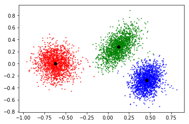

#### Problem 1

(a)由Hoeffding不等式，我们可得对每个$\hat h_i $，
$$
P(|\epsilon(\hat h_i)-\hat \epsilon_{S_{\text{cv}}}(\hat h_i)|>\gamma )
\le 2 k e^{-2\gamma ^2 \beta m} \\
P(|\epsilon(\hat h_i)-\hat \epsilon_{S_{\text{cv}}}(\hat h_i)|\le \gamma )
\ge 1- 2 k e^{-2\gamma ^2 \beta m}
$$
令
$$
2 k e^{-2\gamma ^2 \beta m} =\frac \delta 2
$$
可得
$$
e^{2\gamma ^2 \beta m} =\frac{4k} \delta \\
 2\gamma ^2 \beta m =\log \frac{4k} \delta\\
 \gamma = \sqrt{\frac 1{2\beta m} \log \frac{4k} \delta}
$$
因此至少有$1-\frac \delta 2$的概率，对每个$\hat h_i$，我们有
$$
|\epsilon(\hat h_i)-\hat \epsilon_{S_{\text{scv}}}(\hat h_i)|
\le \sqrt{\frac 1{2\beta m} \log \frac{4k} \delta}
$$
(b)由(a)可得，$\forall i ​$
$$
\begin{eqnarray*}
\epsilon(\hat h_i)
&&\le \hat \epsilon_{S_{\text{scv}}}(\hat h_i)+
\sqrt{\frac 1{2\beta m} \log \frac{4k} \delta}  \tag 1\\
\hat \epsilon_{S_{\text{scv}}}(\hat h_i)&& \le \epsilon(\hat h_i)+\sqrt{\frac 1{2\beta m} \log \frac{4k} \delta} \tag 2
 \end{eqnarray*}
$$
由不等式(2)可得，$\forall i $
$$
\begin{eqnarray*}
\hat \epsilon_{S_{\text{scv}}}(\hat h)
&&= \min_{h\in \{\hat h_1,...,\hat h_k\}} \hat \epsilon_{S_{\text{scv}}}(h) \\
&&\le \hat \epsilon_{S_{\text{scv}}}(\hat h_i) \\
&&\le  \epsilon(\hat h_i)+\sqrt{\frac 1{2\beta m} \log \frac{4k} \delta} \tag 3
\end{eqnarray*}
$$
所以，$\forall i  $
$$
\begin{aligned}
\epsilon(\hat  h) 
&\le \hat \epsilon_{S_{\text{scv}}}(\hat h)+
\sqrt{\frac 1{2\beta m} \log \frac{4k} \delta} \\
&\le  \epsilon(\hat h_i)+\sqrt{\frac 1{2\beta m} \log \frac{4k} \delta} 
+\sqrt{\frac 1{2\beta m} \log \frac{4k} \delta}\\
&\le \epsilon(\hat h_i)+\sqrt{\frac 2{\beta m} \log \frac{4k} \delta}
\end{aligned}
$$
因此
$$
\begin{aligned}
\epsilon(\hat  h) 
\le \min_{i=1,...,k}\epsilon(\hat h_i)+\sqrt{\frac 2{\beta m} \log \frac{4k} \delta}
\end{aligned}
$$
(c)由(b)可知，
$$
\begin{aligned}
\epsilon(\hat  h) 
\le \epsilon(\hat h_j)+\sqrt{\frac 2{\beta m} \log \frac{4k} \delta}
\end{aligned}
$$
记上述事件为$A$，记如下事件为$B$
$$
|\epsilon(\hat h_j) -\hat \epsilon_{S_{\text{train}}}(h_j^*)| \le 
\sqrt{\frac 2{(1-\beta) m} \log \frac{4|\mathcal H_j|} \delta},
\forall j \in \mathcal H_j
$$
因为
$$
P(A)\ge 1-\frac \delta 2 ,P(B) \ge 1-\frac \delta 2
$$
所以
$$
\begin{aligned}
P(AB) &=P(A)+P(B)- P(A\cup B)\\
&\ge 1-\frac \delta 2 +1-\frac \delta 2  -1 \\
&= 1-\delta
\end{aligned}
$$
注意$AB$即为如下事件
$$
\epsilon(\hat h)
\le \epsilon(\hat h_j)+\sqrt{\frac 2{\beta m} \log \frac{4k} \delta}\le \Big( \hat \epsilon_{S_{\text{train}}}(h_j^*)+\sqrt{\frac 2{(1-\beta) m} \log \frac{4|\mathcal H_j|} \delta} \Big)
+\sqrt{\frac 2{\beta m} \log \frac{4k} \delta},
\forall j \in \mathcal H_j \\
\epsilon(\hat h)
\le\min_{j=1,...,k}  \Big( \hat \epsilon_{S_{\text{train}}}(h_j^*)+\sqrt{\frac 2{(1-\beta) m} \log \frac{4|\mathcal H_j|} \delta} \Big)
+\sqrt{\frac 2{\beta m} \log \frac{4k} \delta}
$$
因此
$$
\epsilon(\hat h)
\le\min_{i=1,...,k}  \Big( \hat \epsilon_{S_{\text{train}}}(h_j^*)+\sqrt{\frac 2{(1-\beta) m} \log \frac{4|\mathcal H_j|} \delta} \Big)
+\sqrt{\frac 2{\beta m} \log \frac{4k} \delta}
$$
发生的概率大于等于$1-\delta ​$


#### Problem 2

后面都用$d$表示VC维。

$h(x)=1\{a<x\}​$的VC维是$1​$，首先存在$1​$个点可以shatter，其次对于任意两个点$x_1<x_2​$，标签$(1, 0)​$无法表出，所以
$$
d=1
$$
$h(x)=1\{a<x<b\}$的VC维是$2$，首先存在$2$个点可以shatter（作图即可），其次对于任意三个点$x_1<x_2<x_3$，标签$(1, 0, 1)$无法表出，所以
$$
d =2
$$
$h(x)=1\{a\sin x >0\}​$的VC维是$1​$，首先存在$1​$个点可以shatter（作图即可），其次对于任意两个点$x_1 <x_2​$，我们有
$$
(a\sin x_1 )(a\sin x_2) = \sin x_1 \sin x_2
$$
所以如果
$$
\sin x_1 \sin x_2>0
$$
那么$(1, 0), (0,1)​$的标签无法表出。如果
$$
\sin x_1 \sin x_2\le 0
$$
那么$(1,1)$的标签无法表出。所以
$$
d= 1
$$
$h(x)=1\{\sin(x+a) >0\}$的VC维是$2$，首先$0, \frac \pi 2$可以被shatter，其次由于$\sin $函数的周期为$2\pi$，我们可以假设所有的点属于$[0,2\pi)$。在继续讨论之前，首先将模型转换，将$[0, 2\pi)$上的点映射到单位圆周上，$a$对应过原点的一条直线，直线一侧的点为$1$，另一侧为$0$。

现在假设存在三个点$0\le x_1 < x_2 < x_3<2\pi $可以被shatter，那么标签$(1, 1,1)$表出，由之前讨论可知这表示$x_1,x_2,x_3$在直线的同侧，那么可以发现$(1, 0, 1)$必然无法表出，这是因为$x_1, x_3$在直线的同侧，介于两点之间的点$x_2$必然属于同侧，所以无法表出$(1,0,1)$


#### Problem 3

(a)首先对$J(\theta)​$进行化简：
$$
\begin{aligned}
J(\theta)
&=\frac 1 2 (X\bar \theta +X_i \theta_i -\vec y) ^T(X\bar \theta +X_i \theta_i -\vec y)+\lambda ||\bar \theta||_1 +\lambda s_i \theta_i \\
&=\frac 1 2 (X\bar \theta-\vec y)^T (X\bar \theta-\vec y)
+\frac 12 \theta_i^TX_i^T   X_i \theta_i  +(X\bar \theta-\vec y)^T X_i \theta_i
+\lambda ||\bar \theta||_1 +\lambda s_i \theta_i\\
&=\frac 1 2 (X\bar \theta-\vec y)^T (X\bar \theta-\vec y)
+\frac 12 X_i^T   X_i \theta_i^2  +(X\bar \theta-\vec y)^T X_i \theta_i
+\lambda ||\bar \theta||_1 +\lambda s_i \theta_i
\end{aligned}
$$
所以
$$
\begin{aligned}
\frac{\partial J(\theta)}{\partial  \theta_i}
&=X_i^T   X_i \theta_i+(X\bar \theta-\vec y)^T X_i+ \lambda s_i
\end{aligned}
$$
令上式为$0$可得
$$
\theta_i = -\frac{(X\bar \theta-\vec y)^T X_i+ \lambda s_i}{X_i^T   X_i}
$$
如果$s_i =1$，那么$\theta_i \ge 0$，所以我们有
$$
\theta_i =\max \{-\frac{(X\bar \theta-\vec y)^T X_i+ \lambda }{X_i^T   X_i},0\}
$$
如果$s_i= -1​$，那么$\theta_i <0​$，所以我们有
$$
\theta_i =\min \{-\frac{(X\bar \theta-\vec y)^T X_i- \lambda }{X_i^T   X_i},0\}
$$
(b)代码实现的过程中要分别对$s_i =\pm1$讨论，根据选择产生较小$J(\theta )$对应的$\theta_i $。

```python
# -*- coding: utf-8 -*-
"""
Created on Sat Mar  9 14:27:42 2019

@author: qinzhen
"""

import numpy as np

X = np.genfromtxt("x.dat")
y = np.genfromtxt("y.dat")
theta_true = np.genfromtxt("theta.dat")

def l1l2(X, y, Lambda):
    #数据维度
    n, d = X.shape
    #设置阈值
    D = 1e-5
    #设置初始值
    theta = np.zeros(d)
    #记录上一轮迭代的theta
    theta_pre = np.copy(theta)
    while True:
        #坐标下降
        for i in range(d):
            #第i列
            Xi = X[:, i]
            #theta第i个元素为0
            theta[i] = 0
            #计算
            temp1 = X.dot(theta) - y
            temp2 = np.max([- (temp1.T.dot(Xi) + Lambda) / (Xi.T.dot(Xi)), 0])
            temp3 = np.min([- (temp1.T.dot(Xi) - Lambda) / (Xi.T.dot(Xi)), 0])
            #情形1
            theta[i] = temp2
            loss1 = 1 / 2 * np.sum((X.dot(theta) - y) ** 2) + Lambda * np.sum(np.abs(theta))
            #情形2
            theta[i] = temp3
            loss2 = 1 / 2 * np.sum((X.dot(theta) - y) ** 2) + Lambda * np.sum(np.abs(theta))
            
            #根据较小的loss对应的值更新
            if(loss1 < loss2):
                theta[i] = temp2
            else:
                theta[i] = temp3
        
        #计算误差
        delta = np.linalg.norm(theta - theta_pre)
        if delta < D:
            break

        theta_pre = np.copy(theta)
            
    return theta
```

(b)对Lambda = 1运行，得到如下结果：

```python
theta = l1l2(X, y, 1)
print(theta)
```

```
[ 0.49875676  0.65610562 -0.79057895 -0.6556427  -0.89191611  0.
  0.          0.          0.          0.          0.          0.
  0.          0.          0.          0.          0.          0.
  0.          0.          0.          0.          0.          0.
  0.          0.          0.          0.          0.          0.
  0.          0.          0.          0.          0.          0.
  0.          0.          0.          0.          0.          0.
  0.          0.          0.          0.          0.          0.
  0.          0.          0.          0.          0.          0.
  0.          0.          0.          0.          0.          0.
  0.          0.          0.          0.          0.          0.
  0.          0.          0.          0.          0.          0.
  0.          0.          0.          0.          0.          0.
  0.          0.          0.          0.          0.          0.
  0.          0.          0.          0.          0.          0.
  0.          0.          0.          0.          0.          0.
  0.          0.          0.          0.        ]
```

可以看到最终的$\theta$是稀疏的，所以可以用$l_1$正则化进行特征选择，保留系数不为$0$的特征。


#### Problem 4

这里使用向量化的方法计算每个点距离聚类中心的距离，提高计算效率，介绍如下

假设
$$
X = \left[
 \begin{matrix}
  — (x^{(1)})^T— \\
— (x^{(2)})^T— \\
\vdots\\
— (x^{(m)})^T— 
  \end{matrix}
  \right] \in \mathbb R^{m \times d}, Y =  \left[
 \begin{matrix}
  — (y^{(1)})^T— \\
— (y^{(2)})^T— \\
\vdots\\
— (y^{(n)})^T— 
  \end{matrix}
  \right] \in \mathbb R^{n \times d}
$$
其中$x^{(i)} ,y^{(i)} \in \mathbb R^d$，现在的问题是如何高效计算矩阵$D \in \mathbb R^{m\times n}$，其中
$$
D_{i,j} = ||x^{(i)} -y^{(j)} ||^2
$$
首先对$D_{i,j}$进行处理
$$
\begin{aligned}
D_{i,j} &= ||x^{(i)} -y^{(j)} ||^2 \\
&= (x^{(i)} -y^{(j)})^T (x^{(i)} -y^{(j)})\\
&=(x^{(i)})^T x^{(i)} -2(x^{(i)})^Ty^{(j)} +(y^{(j)})^T y^{(j)}
\end{aligned}
$$
那么
$$
\begin{aligned}
D &=  \left[
 \begin{matrix}
   D_{1,1} & ... & D_{1,n} \\
  ... &  ... &  ... \\
   D_{m,1} &  ... & D_{m,n} 
  \end{matrix}
  \right]  \\
  &= \left[
 \begin{matrix}
   (x^{(1)})^T x^{(1)} -2(x^{(1)})^Ty^{(1)} +(y^{(1)})^T y^{(1)} & ... & 
     (x^{(1)})^T x^{(1)} -2(x^{(1)})^Ty^{(n)} +(y^{(n)})^T y^{(n)}\\
  ... &  ... &  ... \\
   (x^{(m)})^T x^{(m)} -2(x^{(m)})^Ty^{(1)} +(y^{(1)})^T y^{(1)}  &  ... & 
    (x^{(m)})^T x^{(m)} -2(x^{(m)})^Ty^{(n)} +(y^{(n)})^T y^{(n)} 
  \end{matrix}
  \right] \\
  &= \left[
 \begin{matrix}
   (x^{(1)})^T x^{(1)} & ... & 
     (x^{(1)})^T x^{(1)} \\
  ... &  ... &  ... \\
   (x^{(m)})^T x^{(m)}  &  ... & 
    (x^{(m)})^T x^{(m)} 
  \end{matrix}
  \right] +\left[
 \begin{matrix}
   (y^{(1)})^T y^{(1)} & ... & 
     (y^{(n)})^T y^{(n)} \\
  ... &  ... &  ... \\
  (y^{(1)})^T y^{(1)} & ... & 
     (y^{(n)})^T y^{(n)}
  \end{matrix}
  \right]-
  2\left[
 \begin{matrix}
   (x^{(1)})^T y^{(1)} & ... & 
     (x^{(1)})^T y^{(n)} \\
  ... &  ... &  ... \\
  (x^{(m)})^T y^{(1)} & ... & 
     (x^{(m)})^T y^{(n)}
  \end{matrix}
  \right]\\
  &=\left[
 \begin{matrix}
   (x^{(1)})^T x^{(1)} \\
  ...  \\
   (x^{(m)})^T x^{(m)}  
  \end{matrix}
  \right]\underbrace{\left[
 \begin{matrix}
1&...&1
  \end{matrix}
  \right]}_{1\times n矩阵}  +\underbrace{\left[
 \begin{matrix}
1\\ 
\vdots \\
1
  \end{matrix}
  \right]}_{m\times 1矩阵} \left[
 \begin{matrix}
   (y^{(1)})^T y^{(1)}  &
  \ldots  &
  (y^{(n)})^T y^{(n)} 
  \end{matrix}
  \right] -2XY^T
\end{aligned}
$$
利用numpy的广播机制上式可以简写如下：

```python
#计算距离矩阵
d1 = np.sum(X ** 2, axis=1).reshape(-1, 1)
d2 = np.sum(centroids ** 2, axis=1).reshape(1, -1)

dist = d1 + d2 - 2 * X.dot(centroids.T)
```

全部代码如下：

```python
# -*- coding: utf-8 -*-
"""
Created on Sat Mar  9 15:41:53 2019

@author: qinzhen
"""

import numpy as np
import matplotlib.pyplot as plt

def draw_clusters(X, clusters, centroids):
    #颜色列表
    c = ["b", "g", "r", "c", "m", "y"]
    #聚类数量
    d = np.max(clusters)
    #画出每种聚类
    for i in range(d+1):
        plt.scatter(X[clusters==i][:, 0], X[clusters==i][:, 1], c=c[i], s=1)
    
    #画出中心
    plt.scatter(centroids[:, 0], centroids[:, 1], c="black")
    plt.show()

def k_means(X, k, plot=0):
    #数据维度
    n, d = X.shape
    #聚类标签
    clusters = np.zeros(n, dtype=int)
    #初始中心点
    index = np.random.randint(0, n, k)
    #centroids = np.random.rand(k, d)
    centroids = X[index]
    #记录上一轮迭代的聚类中心
    centroids_pre = np.copy(centroids)
    #设置阈值
    D = 1e-5
    
    while True:
        #计算距离矩阵
        d1 = np.sum(X ** 2, axis=1).reshape(-1, 1)
        d2 = np.sum(centroids ** 2, axis=1).reshape(1, -1)
        dist = d1 + d2 - 2 * X.dot(centroids.T)
        
        #STEP1:找到最近的中心
        clusters = np.argmin(dist, axis=1)
        #STEP2:重新计算中心
        for i in range(k):
            centroids[i] = np.mean(X[clusters==i], axis=0)
            
        #计算误差
        delta = np.linalg.norm(centroids - centroids_pre)
        
        #判断是否作图
        if plot:
            draw_clusters(X, clusters, centroids)
        
        if delta < D:
            break
        
        centroids_pre = np.copy(centroids)
        
X = np.genfromtxt("X.dat")

k_means(X, 3, plot=1)
```





#### Problem 5

(a)
$$
\begin{eqnarray*}
l(\theta^{(t+1)})
&&\ge \sum_{i} \sum_{z^{(i)}}Q_i^{(t)}(z^{(i)}) \log \frac {p(x^{(i)},z^{(i)};\theta^{(t+1)})}{Q_i^{(t)}(z^{(i)})} \\
&&\ge \sum_{i} \sum_{z^{(i)}}Q_i^{(t)}(z^{(i)}) \log \frac {p(x^{(i)},z^{(i)};\theta^{(t)})}{Q_i^{(t)}(z^{(i)})}\\
&&=l(\theta^{(t)})
\end{eqnarray*}
$$
第一个不等号成立是因为如下不等式对任意$Q_i​$和$\theta​$都成立
$$
l(\theta)\ge \sum_{i} \sum_{z^{(i)}}Q_i(z^{(i)}) \log \frac {p(x^{(i)},z^{(i)};\theta)}{Q_i(z^{(i)})}
$$
第二个不等号成立是因为梯度上升，等号成立是由$\theta^{(t)}$的定义。

(b)利用定义求梯度即可
$$
\begin{aligned}
\nabla_\theta \sum_{i} \log \sum_{z^{(i)}}p(x^{(i)},z^{(i)};\theta)

&=\sum_{i} \frac{\nabla_\theta \sum_{z^{(i)}} p(x^{(i)},z^{(i)};\theta)}{ \sum_{z^{(i)}}p(x^{(i)},z^{(i)};\theta)} \\
&=\sum_{i}\sum_{z^{(i)}} \frac{\nabla_\theta 
p(x^{(i)},z^{(i)};\theta)}
{ p(x^{(i)};\theta)}
\end{aligned}\\
$$
注意到GEM中的梯度为
$$
\begin{aligned}
\nabla_\theta \sum_{i} \sum_{z^{(i)}}Q_i(z^{(i)}) \log \frac {p(x^{(i)},z^{(i)};\theta)}{Q_i(z^{(i)})} 
&= \sum_{i} \sum_{z^{(i)}}Q_i(z^{(i)})  \nabla_\theta  \log p(x^{(i)},z^{(i)};\theta)\\
&=\sum_{i} \sum_{z^{(i)}}Q_i(z^{(i)}) \frac{\nabla_\theta p(x^{(i)},z^{(i)};\theta)}{p(x^{(i)},z^{(i)};\theta)} 
\end{aligned}
$$
注意我们选择
$$
Q_i(z^{(i)}) =p(z^{(i)}|x^{(i)};\theta) = \frac{p(x^{(i)},z^{(i)};\theta)}{p(x^{(i)};\theta)}
$$
所以GEM中的梯度为
$$
\begin{aligned}
\nabla_\theta \sum_{i} \sum_{z^{(i)}}Q_i(z^{(i)}) \log \frac {p(x^{(i)},z^{(i)};\theta)}{Q_i(z^{(i)})} 
&=\sum_{i} \sum_{z^{(i)}}Q_i(z^{(i)}) \frac{\nabla_\theta p(x^{(i)},z^{(i)};\theta)}{p(x^{(i)},z^{(i)};\theta)} \\
&=\sum_{i} \sum_{z^{(i)}}Q_i(z^{(i)}) \frac{\nabla_\theta p(x^{(i)},z^{(i)};\theta)}{p(x^{(i)};\theta)Q_i(z^{(i)})} \\
&=\sum_{i}\sum_{z^{(i)}} \frac{\nabla_\theta 
p(x^{(i)},z^{(i)};\theta)}
{ p(x^{(i)};\theta)}
\end{aligned}
$$
所以这两者等价。

