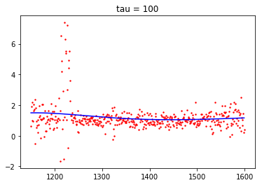

#### 1.Logistic regression    

(a)首先回顾$J(\theta)$的定义
$$
J(\theta) =-\frac 1 m \sum_{i=1}^m \log (h_{\theta}(y^{(i)}x^{(i)}))\\
y(i) ∈\{−1, 1\}, h_θ(x) = g(θ^T x) ,g(z) = 1/(1 + e^{−z})
$$
注意$g^{'}(z) = g(z)(1-g(z))$，利用这点来求$\frac{\partial h_θ(x) }{\partial \theta_k}$
$$
\begin{aligned}
\frac{\partial h_θ(x) }{\partial \theta_k}
&=\frac{\partial g(θ^T x) }{\partial \theta_k}\\
&= g(θ^T x) (1-g(θ^T x) )  \frac{\partial (θ^T x) }{\partial \theta_k} \\
&= g(θ^T x) (1-g(θ^T x) )  x_k\\
&=h_θ(x)(1-h_θ(x))x_k
\end{aligned}
$$
利用$\frac{\partial h_θ(x) }{\partial \theta_k}$来求$\frac{\partial J(\theta)}{\partial \theta_k}$
$$
\begin{aligned}
\frac{\partial J(\theta)}{\partial \theta_k}
&= -\frac 1 m \sum_{i=1}^m \frac{\partial \log (h_{\theta}(y^{(i)}x^{(i)}))}{\partial \theta_k} \\
&= -\frac 1 m \sum_{i=1}^m \frac 1 {h_{\theta}(y^{(i)}x^{(i)}))} \frac{\partial h_{\theta}(y^{(i)}x^{(i)}))}{\partial \theta_k} \\
&= -\frac 1 m \sum_{i=1}^m \frac 1 {h_{\theta}(y^{(i)}x^{(i)}))}  h_θ(y^{(i)}x^{(i)})(1-h_θ(y^{(i)}x^{(i)}))y^{(i)}x_k^{(i)}\\
&= -\frac 1 m \sum_{i=1}^m (1-h_θ(y^{(i)}x^{(i)}))y^{(i)}x_k^{(i)}
\end{aligned}
$$
这个形式方便我们求二阶偏导，继续利用$\frac{\partial h_θ(x) }{\partial \theta_k}​$来求$\frac{\partial^2 J(\theta)}{\partial \theta_l\partial \theta_k}​$
$$
\begin{aligned}
\frac{\partial^2 J(\theta)}{\partial \theta_l\partial \theta_k}
&= -\frac 1 m \sum_{i=1}^m y^{(i)}x_k^{(i)}\frac {\partial {(1-h_θ(y^{(i)}x^{(i)}))}}{\partial \theta_l}\\
&=\frac 1 m \sum_{i=1}^m y^{(i)}x_k^{(i)} \frac {\partial {(h_θ(y^{(i)}x^{(i)}))}}{\partial \theta_l}\\
&=\frac 1 m  \sum_{i=1}^mx_k^{(i)} h_θ(y^{(i)}x^{(i)})(1-h_θ(y^{(i)}x^{(i)})) x_l^{(i)}
\end{aligned}
$$
接着作以下记号
$$
x_k=[x_1^{(k)},...,x_n^{(k)}]^T \in R^n\\
  X=  \left[
 \begin{matrix}
 x_1^T\\
  ...\\
x_m^T 
  \end{matrix}
  \right] \in R^{m\times n} \\
  \Lambda= \text {diag} \{h_θ(y^{(1}x^{(1)})(1-h_θ(y^{(1)}x^{(1)}),...,h_θ(y^{(m)}x^{(m)})(1-h_θ(y^{(m)}x^{(m)})\} \in R^{m\times m}
$$
所以Hessian矩阵$H​$可以表达为如下形式
$$
H= X^T \Lambda X
$$
为了(b)题需要，这里也将$\nabla J(\theta)$表示出来
$$
S = \left[
 \begin{matrix}
  (1-h_θ(y^{(1)}x^{(1)}))y^{(1)} \\
... \\
  (1-h_θ(y^{(m)}x^{(m)}))y^{(m)}
  \end{matrix}
  \right] \in R^m\\
\nabla J(\theta) = -\frac 1  m X^T S
$$
现在任取$z\in R^n$，记$t=X^Tz$，那么
$$
z^THz = z^TX \Lambda X^Tz =t^T \Lambda  t =\sum_{i=1}^m t_i^2 h_θ(y^{(i)}x^{(i)})(1-h_θ(y^{(i)}x^{(i)})
$$
注意$h_θ(y^{(i)}x^{(i)}) \in [0,1]$，所以$h_θ(y^{(i)}x^{(i)})(1-h_θ(y^{(i)}x^{(i)}) \ge 0$，从而
$$
z^THz =\sum_{i=1}^m t_i^2 h_θ(y^{(i)}x^{(i)})(1-h_θ(y^{(i)}x^{(i)}) \ge 0
$$
从而$H$为半正定矩阵。

(b)(c)

这里解释下计算步骤，第一步是读取数据并增加一个截距项，由以下两个函数完成。

```python
%matplotlib inline
import numpy as np
#import matplotlib as mpl
#mpl.use('Agg')
import matplotlib.pyplot as plt
from numpy.linalg import inv
#from __future__ import division


def load_data():
    X = np.genfromtxt('logistic_x.txt')
    Y = np.genfromtxt('logistic_y.txt')
    return X, Y

#增加截距项
def add_intercept(X_):
    m, n = X_.shape
    X = np.zeros((m, n + 1))
    ################
    ones = np.ones((m, 1))
    X = np.append(ones, X_, axis = 1)
    ################
    return X
```

第二步是利用刚刚的公式计算梯度以及$Hessian$矩阵。

```python
#利用之前所述的公式计算
def calc_grad(X, Y, theta):
    m, n = X.shape
    grad = np.zeros(theta.shape)

    ##############
    Y_ = Y.reshape([-1, 1])
    d1 = (X*Y_).dot(theta)
    h = 1 / (1 + np.exp(-d1))
    S = (1 - h) * Y
    grad = -1/m * (X.T).dot(S)

    ##############

    return grad

def calc_hessian(X, Y, theta):
    m, n = X.shape
    H = np.zeros((n, n))

    ##############
    Y = Y.reshape([-1, 1])
    d1 = (X*Y).dot(theta)
    h = 1 / (1 + np.exp(-d1))
    S = np.diag(h * (1-h))
    H = X.T.dot(S).dot(X)

    #############

    return H
```

这里还有两个辅助的函数，分别是计算$J(\theta)$和作图。

```python
def calc_loss(X, Y, theta):
    m, n = X.shape
    loss = 0.

    ###########
    Y = Y.reshape([-1, 1])
    d1 = (X*Y).dot(theta)
    h = 1 / (1 + np.exp(-d1))
    loss = -1/m * np.sum(np.log(h))

    ###########

    return loss

def plot(X, Y, theta):
    #plt.figure()

    ############
    x1 = X[Y>0][:, 1]
    y1 = X[Y>0][:, 2]
    x2 = X[Y<0][:, 1]
    y2 = X[Y<0][:, 2]
    #计算系数
    theta = logistic_regression(X, Y)
    Min = np.min(X[:, 1])
    Max = np.max(X[:, 1])
    x = np.array([Min, Max])
    y = -(theta[0] + theta[1]*x)/theta[2]
    plt.scatter(x1, y1)
    plt.scatter(x2, y2)
    plt.plot(x, y)
    plt.title('Newton’s method for Logistic regression')
    ############

    plt.savefig('ps1q1c.png')
    return
```

最重要的一步就是利用如下公式迭代计算：
$$
\theta = \theta - H^{-1} \nabla J(\theta)
$$

```python
def logistic_regression(X, Y):
    m, n = X.shape
    theta = np.zeros(n)

    ############
    H = calc_hessian(X, Y, theta)
    grad = calc_grad(X, Y, theta)
    theta -= inv(H).dot(grad)
    ############

    return theta
```

```python
X_, Y = load_data()
X = add_intercept(X_)
theta = logistic_regression(X, Y)
plot(X, Y, theta)
```


全部代码可以查看my_logistic.py这个文件。


#### 2.Poisson regression and the exponential family

(a)
$$
p(y; λ) =\frac{ e^{−λ}λ^y}{y!} =\frac 1 {y!} e^{y \log \lambda-\lambda}
$$
对比指数族的形式
$$
p(y; η) = b(y) \exp(η^T T (y) − a(η))
$$
可得
$$
b(y) = \frac 1 {y!},\eta = \log \lambda,T(y)=y,a(\eta) =\lambda =e^{\eta}
$$
所以泊松分布为指数族

(b)我们来计算$g(η) = E[T (y); η]$
$$
E[T (y); η]= E[y; η] =\lambda =e^{\eta}
$$
(c)根据GLM的性质可知$\eta = \theta^T x​$，那么$\lambda=e^{\eta} =e^{\theta^T x}​$

计算对数似然函数
$$
\begin{aligned}
l &= \log p(y^{(i)}|x^{(i)}; θ)\\
&= \log(\frac{ e^{−λ}λ^{y^{(i)}}}{y^{(i)}!} )\\
&=y^{(i)}\log \lambda -\lambda -\log(y^{(i)}!)\\
&=y^{(i)}\theta^T x^{(i)} -e^{\theta^T x^{(i)}} -\log(y^{(i)}!)
\end{aligned}
$$
关于$\theta_j$求偏导可得
$$
\frac{\partial l}{\partial \theta_j} =y^{(i)}x^{(i)}_j -e^{\theta^T x^{(i)}} x_j=(y^{(i)}-e^{\theta^T x^{(i)}} )x_j
$$
此处求最大值，用随机梯度上升法，更新规则为
$$
\theta_j = \theta_j+ (y^{(i)}-e^{\theta^T x^{(i)}} )x_j= \theta_j - (e^{\theta^T x^{(i)}}-y^{(i)} )x_j
$$
(d)$T(y)=y$，所以
$$
p(y; η) = b(y) \exp(η^T T (y) − a(η)) = b(y) \exp(η^T y − a(η))
$$

$$
E[T (y); η]= E[y; η]
$$

$$
\begin{aligned}
l &=\log p(y|X; θ)\\
&=\log \Big( b(y) \exp(η^T y − a(η) )\Big)\\
&=η^T y − a(η) +\log b(y) 
\end{aligned}
$$

因为$\eta = \theta^Tx$，所以
$$
\frac{\partial l}{\partial \theta_j} =y x_j - \frac{\partial  a(η)}{\partial η}\frac{\partial  η}{\partial \theta_j}= (y-\frac{\partial  a(η)}{\partial η})x_j
$$
接下来只要证明$\frac{\partial  a(η)}{\partial η}= h(x) =E[y;\eta]$即可，利用$p(y; η) $为概率密度函数
$$
\int_{-\infty}^{+\infty} b(y) \exp(η^Ty − a(η)) dy =1\\
\int_{-\infty}^{+\infty} b(y) \exp(η^Ty ) dy =\exp(a(η)) \\
两边关于\eta求偏导可得\\
\int_{-\infty}^{+\infty}y b(y) \exp(η^T y))dy =\exp(a(η)) \frac{\partial  a(η)}{\partial η}\\
\frac{\partial  a(η)}{\partial η} =\int_{-\infty}^{+\infty} yb(y) \exp(η^Ty − a(η)) dy =E[y;\eta]
$$
所以
$$
\frac{\partial l}{\partial \theta_j} = (y-h(x))x_j
$$
从而梯度上升法的更新规则为
$$
\theta_j = \theta_j+\alpha (y-h(x))x_j =\theta_j-\alpha (h(x)-y)x_j
$$


#### 3.Gaussian discriminant analysis

(a)先计算$P(x)$
$$
\begin{aligned}
P(x) &= P(y=1)P(x|y=1) + P(y=-1)P(x|y=-1)\\
&=\phi  \frac1{(2π)^{n/2}|Σ|^{1/2} }\text{exp} \Big (−\frac 12(x − \mu_1)^T Σ^{−1}(x − \mu_1)\Big)+
(1-\phi)  \frac1{(2π)^{n/2}|Σ|^{1/2} }\text{exp} \Big (−\frac 12(x − \mu_{-1})^T Σ^{−1}(x − \mu_{-1})\Big)
\end{aligned}
$$
利用贝叶斯公式计算$P(y|x)$，分$y=1,y=-1$计算
$$
\begin{aligned}
P(y|x)
&=\frac{P(x|y)P(y)}{P(x)}\\
&=\frac{P(x|y)P(y)}{\phi  \frac1{(2π)^{n/2}|Σ|^{1/2} }\text{exp} \Big (−\frac 12(x − \mu_1)^T Σ^{−1}(x − \mu_1)\Big)+
(1-\phi)  \frac1{(2π)^{n/2}|Σ|^{1/2} }\text{exp} \Big (−\frac 12(x − \mu_{-1})^T Σ^{−1}(x − \mu_{-1})\Big)}
\end{aligned}
$$
所以
$$
\begin{aligned}
P(y=1|x)
&=\frac{P(x|y=1)P(y=1)}{\phi  \frac1{(2π)^{n/2}|Σ|^{1/2} }\text{exp} \Big (−\frac 12(x − \mu_1)^T Σ^{−1}(x − \mu_1)\Big)+
(1-\phi)  \frac1{(2π)^{n/2}|Σ|^{1/2} }\text{exp} \Big (−\frac 12(x − \mu_{-1})^T Σ^{−1}(x − \mu_{-1})\Big)}\\
&=\frac{ \frac1{(2π)^{n/2}|Σ|^{1/2} }\text{exp} \Big (−\frac 12(x − \mu_1)^T Σ^{−1}(x − \mu_1)\Big)\phi}{\phi  \frac1{(2π)^{n/2}|Σ|^{1/2} }\text{exp} \Big (−\frac 12(x − \mu_1)^T Σ^{−1}(x − \mu_1)\Big)+
(1-\phi)  \frac1{(2π)^{n/2}|Σ|^{1/2} }\text{exp} \Big (−\frac 12(x − \mu_{-1})^T Σ^{−1}(x − \mu_{-1})\Big)}\\
&=\frac{1}{1+\frac{1-\phi}{\phi} \text{exp} \Big (−\frac 12(x − \mu_{-1})^T Σ^{−1}(x − \mu_{-1})+\frac 12(x − \mu_1)^T Σ^{−1}(x − \mu_1)\Big)}
\end{aligned}
$$

$$
\begin{aligned}
P(y=-1|x)
&=\frac{P(x|y=-1)P(y=-1)}{\phi  \frac1{(2π)^{n/2}|Σ|^{1/2} }\text{exp} \Big (−\frac 12(x − \mu_1)^T Σ^{−1}(x − \mu_1)\Big)+
(1-\phi)  \frac1{(2π)^{n/2}|Σ|^{1/2} }\text{exp} \Big (−\frac 12(x − \mu_{-1})^T Σ^{−1}(x − \mu_{-1})\Big)}\\
&=\frac{ (1-\phi)  \frac1{(2π)^{n/2}|Σ|^{1/2} }\text{exp} \Big (−\frac 12(x − \mu_{-1})^T Σ^{−1}(x − \mu_{-1})\Big)}
{\phi  \frac1{(2π)^{n/2}|Σ|^{1/2} }\text{exp} \Big (−\frac 12(x − \mu_1)^T Σ^{−1}(x − \mu_1)\Big)+
(1-\phi)  \frac1{(2π)^{n/2}|Σ|^{1/2} }\text{exp} \Big (−\frac 12(x − \mu_{-1})^T Σ^{−1}(x − \mu_{-1})\Big)}\\
&=\frac{1}{1+\frac{\phi} {1-\phi} \text{exp} \Big (-\frac 12(x − \mu_1)^T Σ^{−1}(x − \mu_1)+\frac 12(x − \mu_{-1})^T Σ^{−1}(x − \mu_{-1})\Big)}
\end{aligned}
$$

可以看到，指数部分都有一样的式子，现在计算这个式子
$$
\begin{aligned}
−\frac 12(x − \mu_{-1})^T Σ^{−1}(x − \mu_{-1})+\frac 12(x − \mu_1)^T Σ^{−1}(x − \mu_1)
&=\frac 1 2
\Big(x^T Σ^{−1}x -2\mu_1 ^T Σ^{−1}x + \mu_1 ^T Σ^{−1}  \mu_1
-x^T Σ^{−1}x+2\mu_{-1} ^T Σ^{−1}x -\mu_{-1} ^T Σ^{−1}  \mu_{-1}\Big) \\ 
&=\frac 1 2 \Big( 2(\mu_{-1} ^T Σ^{−1}-\mu_1 ^T Σ^{−1})x + \mu_1 ^T Σ^{−1}\mu_1 -\mu_{-1} ^T Σ^{−1}  \mu_{-1} \Big)\\
&=(\mu_{-1} ^T Σ^{−1}-\mu_1 ^T Σ^{−1})x +\frac 1 2 (\mu_1 ^T Σ^{−1}\mu_1 -\mu_{-1} ^T Σ^{−1}  \mu_{-1} )
\end{aligned}
$$
所以
$$
\begin{aligned}
P(y=1|x) 
&=\frac{1}{1+\frac{1-\phi}{\phi} \text{exp} \Big ((\mu_{-1} ^T Σ^{−1}-\mu_1 ^T Σ^{−1})x +\frac 1 2 (\mu_1 ^T Σ^{−1}\mu_1 -\mu_{-1} ^T Σ^{−1}  \mu_{-1} )\Big)}\\
&=\frac{1}{1+\text{exp} \Big ((\mu_{-1} ^T Σ^{−1}-\mu_1 ^T Σ^{−1})x +\frac 1 2 (\mu_1 ^T Σ^{−1}\mu_1 -\mu_{-1} ^T Σ^{−1}  \mu_{-1} )
+\text{ln}(\frac{1-\phi}{\phi}) \Big)}
\end{aligned}\\

\begin{aligned}
P(y=-1|x) 
&=\frac{1}{1+\frac{\phi} {1-\phi} \text{exp} \Big (-\frac 12(x − \mu_1)^T Σ^{−1}(x − \mu_1)+\frac 12(x − \mu_{-1})^T Σ^{−1}(x − \mu_{-1})\Big)}\\
&=\frac{1}{1+\text{exp} \Big (-(\mu_{-1} ^T Σ^{−1}-\mu_1 ^T Σ^{−1})x -\frac 1 2 (\mu_1 ^T Σ^{−1}\mu_1 -\mu_{-1} ^T Σ^{−1}  \mu_{-1} ) -\text{ln}(\frac{1-\phi}{\phi})\Big)}
\end{aligned}
$$
综合两式，$P(y|x) $可以写为
$$
\begin{aligned}
P(y|x) 
&=\frac{1}{1+\text{exp} \Big (y\Big((\mu_{-1} ^T Σ^{−1}-\mu_1 ^T Σ^{−1})x +\frac 1 2 (\mu_1 ^T Σ^{−1}\mu_1 -\mu_{-1} ^T Σ^{−1}  \mu_{-1} )
+\text{ln}(\frac{1-\phi}{\phi})\Big) \Big)}\\
&=\frac{1}{1+\text{exp} \Big (-y\Big((\mu_1 ^T Σ^{−1} -\mu_{-1} ^T Σ^{−1})x -\frac 1 2 (\mu_1 ^T Σ^{−1}\mu_1 -\mu_{-1} ^T Σ^{−1}  \mu_{-1} )
-\text{ln}(\frac{1-\phi}{\phi})\Big) \Big)}
\end{aligned}
$$
令
$$
\theta = (\mu_1 ^T Σ^{−1} -\mu_{-1} ^T Σ^{−1})^T = Σ^{−1} (\mu_1 - \mu_{-1})\\
\theta_0 =  -\frac 1 2 (\mu_1 ^T Σ^{−1}\mu_1 -\mu_{-1} ^T Σ^{−1}  \mu_{-1} )
-\text{ln}(\frac{1-\phi}{\phi})
$$
从而
$$
p(y | x; φ, Σ, \mu_{−1}, \mu_1) = \frac{1}
{1 + \text{exp}(−y(θ^T x + θ_0))}
$$
(b)(c)

(c)是(b)的一般情形，所以直接处理(c)

先观察$P(x|y)$的形式，可以得到如下公式
$$
P(x|y) = \frac1{(2π)^{n/2}|Σ|^{1/2} }\text{exp} \Big (−\frac 12(x − \mu_y)^T Σ^{−1}(x − \mu_y)\Big)
$$
接着计算$\text{log}P(x,y)$
$$
\begin{aligned}
\text{log} P(x,y) 
&= \text{log}P(x|y)P(y)\\
&=\text{log}\Big(  \frac1{(2π)^{n/2}|Σ|^{1/2} }\text{exp} \Big (−\frac 12(x − \mu_y)^T Σ^{−1}(x − \mu_y)\Big) \phi ^{ 1\{y = 1\}} (1-\phi)^{^{ 1\{y = -1\}}} \Big) \\
&= \text{log}  \frac1{(2π)^{n/2}|Σ|^{1/2}} −\frac 12(x − \mu_y)^T Σ^{−1}(x − \mu_y)  + 1\{y = 1\} \text{log} \phi + 1\{y = -1\} \log(1-\phi)
\end{aligned}
$$
对数似然函数为
$$
\begin{aligned}
ℓ(φ, \mu_{−1}, \mu_1, Σ) 
&=\text{log}\prod_{i=1}^m p(x^{(i)}, y^{(i)}; φ, \mu_{−1}, \mu_1, Σ)\\
&= \sum_{i=1}^{m}  \text{log}  p(x^{(i)}, y^{(i)}; φ, \mu_{−1}, \mu_1, Σ)\\
&= \sum_{i=1}^{m} \Big( \text{log}  \frac1{(2π)^{n/2}|Σ|^{1/2}} −\frac 12(x^{(i)} − \mu_{y^{(i)}})^T Σ^{−1}(x^{(i)} − \mu_{y^{(i)}})  + 1\{y^{(i)} = 1\} \text{log} \phi + 1\{y^{(i)} = -1\} \log(1-\phi) \Big)\\
\end{aligned}
$$

关于$\phi$求梯度
$$
\frac{\partial ℓ}{\partial \phi} = \sum_{i=1}^{m} \Big( \frac{1\{y^{(i)} = 1\} }{\phi}- \frac{1\{y^{(i)} = -1\}}{1- \phi}\Big) = 0\\
\sum_{i=1}^{m} 1\{y^{(i)} = 1\} (1-\phi)   - 1\{y^{(i)} = -1\}  \phi  =0 \\
\sum_{i=1}^{m} 1\{y^{(i)}= 1\}  = m\phi \\
\phi = \frac{1}{m} \sum_{i=1}^{m} 1\{y^{(i)}= 1\}
$$
关于$\mu_1,\mu_{-1}$求梯度
$$
\nabla_{\mu_1} ℓ = −\sum_{i=1}^{m}Σ^{−1}(x^{(i)} − \mu_{y^{(i)}})1 \{y^{(i)} = 1\} =0\\
\sum_{i=1}^{m} (x^{(i)} − \mu_1)1 \{y^{(i)} = 1\} =0\\
\mu_1= \frac{\sum_{i=1}^{m}1\{y^{(i)} = 1\}x^{(i)} }{\sum_{i=1}^{m}1\{y^{(i)} = 1\}} \\
\nabla_{\mu_{-1}} ℓ = −\sum_{i=1}^{m}Σ^{−1}(x^{(i)} − \mu_{y^{(i)}})1 \{y^{(i)} =- 1\} =0\\
\sum_{i=1}^{m} (x^{(i)} − \mu_{-1})1 \{y^{(i)} = -1\} =0\\
\mu_{-1}= \frac{\sum_{i=1}^{m}1\{y^{(i)} =- 1\}x^{(i)} }{\sum_{i=1}^{m}1\{y^{(i)} = -1\}}
$$
求$\sum$的时候利用一些技巧性，我们不求$\sum$的极大似然估计，而是求$\sum^{-1}$的极大似然估计，然后再求出$\sum$的极大似然估计，利用如下两个式子
$$
\nabla_A \det|A| = \det|A|(A ^{-1})^T\\
\nabla_A (x^TAy) = \nabla_A  \text{trace}(x^TAy) =  xy^T
$$
那么
$$
\nabla_{\sum^{-1}} ℓ = \nabla_{\sum^{-1}} \Big( \frac m 2 \log \Big|{\sum}^{-1} \Big|   \Big) -  \frac 12 \nabla_{\sum^{-1}} \sum_{i=1}^{m} (x^{(i)} − \mu_y^{(i)})^T Σ^{−1}(x^{(i)} − \mu_y^{(i)}) = 0\\
  \frac m 2 \frac{1}{ \Big|{\sum}^{-1} \Big|}  \Big|{\sum}^{-1} \Big|{\sum} -\frac 1 2  \sum_{i=1}^{m}  (x^{(i)} − \mu_y^{(i)}) (x^{(i)} − \mu_y^{(i)})^T = 0\\
  \sum = \frac 1  m  \sum_{i=1}^{m}  (x^{(i)} − \mu_y^{(i)}) (x^{(i)} − \mu_y^{(i)})^T
$$
所以结论成立。


#### 4.Linear invariance of optimization algorithms

(a)我们计算$∇_zg(z),∇_z^2g(z)$。

先计算$∇_zg(z),$
$$
\begin{aligned}
\frac{\partial g(z)}{\partial z_i} &=\sum_{k=1}^n\frac{\partial f(Az)}{\partial (Az)_k}\frac {\partial (Az)_k}{\partial z_i}\\
&=\sum_{k=1}^n\frac{\partial f(Az)}{\partial x_k}\frac {\partial (Az)_k}{\partial z_i}\\
&=\sum_{k=1}^n\frac{\partial f(Az)}{\partial x_k}A_{ki}\\
&=(A^T)_i \nabla_x f(Az)
\end{aligned}\\
(A^T)_i表示A^T的第i行
$$
所以
$$
∇_zg(z)= A^T \nabla_x f(Az)
$$
接着计算$∇_z^2g(z)​$
$$
\begin{aligned}
\frac{\partial^2 g(z)}{\partial z_j \partial z_i} 
&=\frac{\partial\Big(\sum_{k=1}^n\frac{\partial f(Az)}{\partial x_k}A_{ki}\Big)}{\partial z_j}\\
&=\sum_{k=1}^n \sum_{l=1}^n\frac{\partial^2 f(Az)}{\partial (Az)_l\partial x_k}  \frac{\partial (Az)_l}{\partial x_j}A_{ki}\\
&=\sum_{k=1}^n \sum_{l=1}^n\frac{\partial^2 f(Az)}{\partial (Az)_l\partial x_k}  \frac{\partial (Az)_l}{\partial x_j}A_{ki}\\
&=\sum_{k=1}^n \sum_{l=1}^n\frac{\partial^2 f(Az)}{\partial x_l\partial x_k} A_{lj}A_{ki}
\end{aligned} 
$$
从而
$$
∇_z^2g(z) = A^T  ∇_x^2f(Az) A
$$
接着利用数学归纳法来证明结论。

$n=0$时，
$$
z^{(0)} = A^{-1}x^{(0)} =0
$$
所以$n=0$时结论成立。假设$n\le i$时，$z^{(n)} = A^{-1}x^{(n)}$，那么$n=i+1$时
$$
\begin{aligned}
z^{(i+1)} &=z^{(i)} -  (\nabla^2_z g(z^{(i)}))^{−1}∇_zg(z)\\
&= A^{-1}x^{(i)}  - A^{-1}( ∇_x^2f(Az^{(i)}) )^{-1} (A^{T})^{-1} A^T \nabla_x f(Az^{(i)})\\
&=A^{-1}x^{(i)} - A^{-1}( ∇_x^2f(Az^{(i)}) )^{-1}  \nabla_x f(Az^{(i)})\\
&=A^{-1}(x^{(i)} - (∇_x^2f(Az^{(i)})) ^{-1}  \nabla_x f(Az^{(i)}))\\
&=A^{-1}(x^{(i)} -( ∇_x^2f(x^{(i)}) )^{-1}  \nabla_x f(x^{(i)}))\\
&=A^{-1} x^{(i+1)}
\end{aligned}
$$
其中倒数第二步是因为$x^{(i)} = Az^{(i)}$，所以$n=i+1$时结论成立，从而牛顿法满足invariant to linear reparameterizations

(b)对于梯度下降法， 继续利用
$$
∇_zg(z)= A^T \nabla_x f(Az)
$$
假设$z^{(i)} = A^{-1} x^{(i)}$，那么
$$
\begin{aligned}
z^{(i+1)} 
&=z^{(i)} -  \alpha∇_zg(z)\\
&=A^{-1}x^{(i)} - \alpha  A^T \nabla_x f(Az)\\
&=A^{-1}x^{(i)} - \alpha  A^T \nabla_x f(x^{(i)})
\end{aligned}\\
$$

但是
$$
x^{(i+1)} = x^{(i)}  - \alpha \nabla_x f(x^{(i)})\\
A^{-1}x^{(i+1)}= A^{-1}x^{(i)}  - \alpha A^{-1}  \nabla_x f(x^{(i)})
$$
所以$z^{(i+1)} $与$A^{-1}x^{(i+1)}$不相等，从而梯度下降法不满足invariant to linear reparameterizations


#### 5.Regression for denoising quasar spectra

(a)

(i)
$$
J(θ) = \frac 1 2 \sum_{i=1}^m w^{(i)} \Big(θ^T x^{(i)} − y^{(i)}\Big)^2
$$
记
$$
X = [x^{(1)},...,x^{(m)}]^T\\
y = [y^{(1)},...,y^{(m)}]^T\\
W=\frac 1 2 \text{diag}\{w^{(1)},...,w^{(m)} \}
$$
那么
$$
J(θ) = (Xθ − y)^T W (Xθ − y)
$$
(ii)
$$
\begin{aligned}
J(θ) 
&= (Xθ − y)^T W (Xθ − y)\\
&= \theta^T X^T WX \theta - 2y^TW^TX\theta +y^Ty
\end{aligned}\\
\nabla J(\theta)= 2  X^T WX \theta - 2X^TWy =0\\
\theta =( X^T WX )^{-1} X^TWy
$$
(iii)
$$
p(y^{(i)}|x^{(i)}; θ) = \frac 1 {\sqrt {2π}σ^{ (i)}} \text{exp}\Big(−\frac{(y^{(i)} −θ^T x^{(i)})^2}{2(σ^{(i)})^2}\Big)^2
$$
概率似然函数为
$$
\prod_{i=1}^m \frac 1 {\sqrt {2π}σ^{ (i)}} \text{exp}\Big(−\frac{(y^{(i)} −θ^T x^{(i)})^2}{2(σ^{(i)})^2}\Big)^2
=\Big(\prod_{i=1}^m \frac 1 {\sqrt {2π}σ^{ (i)}}\Big) \text{exp}\Big(−\sum_{i=1}^m\frac{(y^{(i)} −θ^T x^{(i)})^2}{2(σ^{(i)})^2}\Big)^2
$$
对于固定的$\sigma^{(i)}$，最大化这个概率似然函数等价于最小化
$$
\frac 1 2 \sum_{i=1}^m\frac{(y^{(i)} −θ^T x^{(i)})^2}{(σ^{(i)})^2}
$$
记$w^{(i)}=\frac 1 {{(σ^{(i)})^2}}$，这个是式子可以转化为
$$
\frac 1 2 \sum_{i=1}^m w^{(i)}{(y^{(i)} −θ^T x^{(i)})^2}
$$

(b)

(i)

第一步还是读取数据以及增加截距。


```python
%matplotlib inline
import numpy as np
#import matplotlib as mpl
#mpl.use('Agg')
import matplotlib.pyplot as plt
from numpy.linalg import inv

def load_data():
    train = np.genfromtxt('quasar_train.csv', skip_header=True, delimiter=',')
    test = np.genfromtxt('quasar_test.csv', skip_header=True, delimiter=',')
    wavelengths = np.genfromtxt('quasar_train.csv', skip_header=False, delimiter=',')[0]
    return train, test, wavelengths

def add_intercept(X_):
    X = None
    #####################
    X_ = X_.reshape((-1, 1))
    m, n = X_.shape
    ones = np.ones((m, 1))
    X = np.append(ones, X_, axis = 1)

    ###################
    return X
```

这一部分直接利用最小二乘法计算结果。


```python
#利用最小二乘公式
def LR_smooth(Y, X_):
    X = add_intercept(X_)
    Y = Y.reshape((-1, 1))
    yhat = np.zeros(Y.shape)
    theta = np.zeros(2)
    #####################
    theta = inv(X.T.dot(X)).dot(X.T).dot(Y)
    yhat = X.dot(theta)

    #####################
    return yhat, theta
```

作图函数


```python
def plot_b(X, raw_Y, Ys, desc, filename):
    plt.figure()
    ############
    for i in range(len(Ys)):
        plt.scatter(X, raw_Y, c='red', s=2, label='raw_data')
        plt.plot(X, Ys[i], c='blue', label='Regression line')
        plt.title(desc[i])
        plt.show()

    ############
    plt.savefig(filename)
```

产生结果


```python
raw_train, raw_test, wavelengths = load_data()

## Part b.i
lr_est, theta = LR_smooth(raw_train[0], wavelengths)
print('Part b.i) Theta=[%.4f, %.4f]' % (theta[0], theta[1]))
plot_b(wavelengths, raw_train[0], [lr_est], ['Regression line'], 'ps1q5b1.png')
```

    Part b.i) Theta=[2.5134, -0.0010]


(ii)利用a中的公式$\theta =( X^T WX )^{-1} X^TWy$计算


```python
def LWR_smooth(spectrum, wavelengths, tau):
    smooth_spectrum = np.array([])
    ###############
    X = add_intercept(wavelengths)
    Y = spectrum.reshape((-1, 1))
    for i in range(len(wavelengths)):
        w = np.exp(-(wavelengths - wavelengths[i])**2 / (2*tau**2))
        W = np.diag(w)
        theta = inv(X.T.dot(W).dot(X)).dot(X.T).dot(W).dot(Y)
        yhat = theta.T.dot(X[i])
        smooth_spectrum = np.append(smooth_spectrum, yhat)
    ###############
    return smooth_spectrum
```

计算结果


```python
## Part b.ii
lwr_est_5 = LWR_smooth(raw_train[0], wavelengths, 5)
plot_b(wavelengths, raw_train[0], [lwr_est_5], ['tau = 5'], 'ps1q5b2.png')
```


对不同的参数作图。


```python
### Part b.iii
lwr_est_1 = LWR_smooth(raw_train[0], wavelengths, 1)
lwr_est_10 = LWR_smooth(raw_train[0], wavelengths, 10)
lwr_est_100 = LWR_smooth(raw_train[0], wavelengths, 100)
lwr_est_1000 = LWR_smooth(raw_train[0], wavelengths, 1000)
plot_b(wavelengths, raw_train[0],
         [lwr_est_1, lwr_est_5, lwr_est_10, lwr_est_100, lwr_est_1000],
         ['tau = 1', 'tau = 5', 'tau = 10', 'tau = 100', 'tau = 1000'],
         'ps1q5b3.png')
```





(c)

(i)

第一步是利用局部加权回归来使得数据更平滑一些。


```python
def smooth_data(raw, wavelengths, tau):
    smooth = None
    ################
    smooth = []
    for spectrum in raw:
        smooth.append(LWR_smooth(spectrum, wavelengths, tau))
    ################
    return np.array(smooth)

smooth_train, smooth_test = [smooth_data(raw, wavelengths, 5) for raw in [raw_train, raw_test]]
```

(ii)
这部分比较难懂，详细解释下各个步骤，第一步将数据分为左边和右边，波长小于1200的为left，大于1300的为right，利用如下函数完成这部分工作。


```python
def split(full, wavelengths):
    left, right = None, None
    ###############
    indexl = np.argwhere(wavelengths == 1200)[0][0]
    indexr = np.argwhere(wavelengths == 1300)[0][0]
    left = full[:, :indexl]
    right = full[:, indexr:]
    ###############
    return left, right
```

第二步要计算距离，定义如下函数


```python
def dist(a, b):
    dist = 0
    ################
    dist = ((a - b)**2).sum()
    ################
    return dist
```


```python
#### Part c.ii
left_train, right_train = split(smooth_train, wavelengths)
left_test, right_test = split(smooth_test, wavelengths)
```

最后一步是最复杂的，首先计算距离，这里的距离定义为
$$
d(f_1, f_2) = \sum_i (f_1(λ_i) − f_2(λ_i))^2
$$
对于此题来说，$f_1(\lambda),f_2(\lambda)$分别对应了测试数据以及训练数据，利用下式计算距离矩阵。

```python
d = (right_train - right_test)**2

#求和
d1 = d.sum(axis=1)
```

然后要找到距离最近的$k$个点，这里为$3$个点，我的思路是先对数据进行排序，然后找到前三个数据的索引

```python
#找到排名前3的作为neighb_k(f_right)
tempd = d1.copy()
tempd.sort()
#找到索引
index = (d1==tempd[0])|(d1==tempd[1])|(d1==tempd[2])
```

接着计算$h$，为距离的最大值，根据题目中的公式对数据进行转换

    h = d1.max()
    d1 = d1/h

最后一步根据kernel以及题目中的公式计算即可

```python
d1 = 1 - d1
#求lefthat
a = (d1[index].dot(left_train[index]))
b = d1[index].sum()

lefthat = a/b
```

以上全部综合起来就是如下函数：

```python
def func_reg(left_train, right_train, right_test):
    m, n = left_train.shape
    #m=200,n=50
    lefthat = np.zeros(n)
    ###########################
    #right_train 200*300
    #right_test  1*300
    #left_train  200*50
    #求题目中的d(f1,f2),先求每个点的距离,200*300矩阵
    d = (right_train - right_test)**2
    #按照行求和200*1
    d1 = d.sum(axis=1)
    #找到排名前3的作为neighb_k(f_right)
    tempd = d1.copy()
    tempd.sort()
    #找到索引
    index = (d1==tempd[0])|(d1==tempd[1])|(d1==tempd[2])
    #h为d1中的最大值
    h = d1.max()
    d1 = d1/h
    #ker (1-t)
    d1 = 1 - d1
    #求lefthat
    a = (d1[index].dot(left_train[index]))
    b = d1[index].sum()
    
    lefthat = a/b
    ###########################
    return lefthat
```

作图函数


```python
#将左边右边区分开来,左边<1200,右边>=1300
def plot_c(Yhat, Y, X, filename):
    plt.figure()
    ############
    plt.plot(X[:50],Yhat)
    plt.plot(X,Y)
    plt.show()
    #############
    plt.savefig(filename)
    return
```

产生结果


```python
#### Part c.ii
left_train, right_train = split(smooth_train, wavelengths)
left_test, right_test = split(smooth_test, wavelengths)

train_errors = [dist(left, func_reg(left_train, right_train, right)) for left, right in zip(left_train, right_train)]
print('Part c.ii) Training error: %.4f' % np.mean(train_errors))
```

    Part c.ii) Training error: 1.0664

(iii)

```python
### Part c.iii
test_errors = [dist(left, func_reg(left_train, right_train, right)) for left, right in zip(left_test, right_test)]
print('Part c.iii) Test error: %.4f' % np.mean(test_errors))

left_1 = func_reg(left_train, right_train, right_test[0])
plot_c(left_1, smooth_test[0], wavelengths, 'ps1q5c3_1.png')
left_6 = func_reg(left_train, right_train, right_test[5])
plot_c(left_6, smooth_test[5], wavelengths, 'ps1q5c3_6.png')
```

    Part c.iii) Test error: 2.7100


全部代码可以查看my_quasars.py这个文件。
